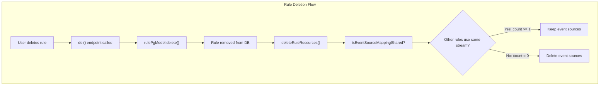
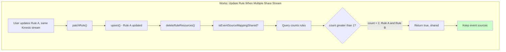
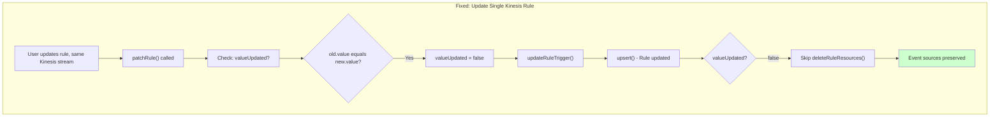
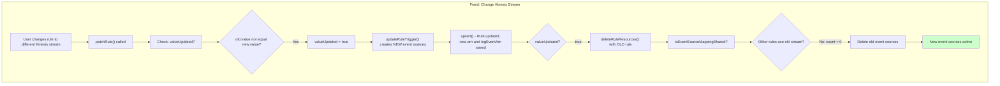

# CUMULUS-4000: Comprehensive Fix Plan

## Problem Summary

When updating a Cumulus rule in the dashboard that references a Kinesis stream, the event source mappings (connections between the Kinesis stream and Lambda functions) are incorrectly deleted if:
1. Only one rule uses that Kinesis stream
2. The update doesn't change the Kinesis stream (e.g., changing workflow, collection, or metadata)

This silently breaks data ingestion - new records in the Kinesis stream will not trigger workflows because the Lambda functions are no longer connected to the stream.

---

## Technical Explanation

### What Are Event Source Mappings?

Event source mappings are AWS Lambda features that connect an event source (like a Kinesis stream) to a Lambda function. When a rule uses a Kinesis stream, Cumulus creates two event source mappings:

1. **messageConsumer Lambda** - Processes Kinesis records and triggers workflows
2. **KinesisInboundEventLogger Lambda** - Logs incoming Kinesis events for debugging

The UUIDs for these mappings are stored in the rule's `arn` and `logEventArn` fields.

### The Bug Flow

When a rule is updated via the API:

1. `updateRuleTrigger` is called - if the Kinesis stream (`rule.value`) hasn't changed, no new event sources are created
2. The rule is saved to the database via `upsert`
3. `deleteRuleResources` is **always called** for kinesis/sns rules (unconditionally)
4. `deleteRuleResources` checks if event sources are "shared" with other rules
5. The sharing check **counts ALL rules** including the just-updated rule
6. For a single rule, count = 1 → determined as "not shared" → event sources deleted

---

## Current System Diagrams

### Happy Path: Rule Deletion (Works Correctly)



### Bug Path: Rule Update (Single Rule, Same Stream)

```mermaid
flowchart TD
    subgraph bugPath ["Bug: Update Single Kinesis Rule"]
        B1["User updates rule, same Kinesis stream"] --> B2["patchRule() called"]
        B2 --> B3["updateRuleTrigger()"]
        B3 --> B4{"value changed?"}
        B4 -->|"No"| B5["Keep existing arn and logEventArn"]
        B5 --> B6["rulePgModel.upsert()"]
        B6 --> B7["Rule updated in DB, still has same arn and logEventArn"]
        B7 --> B8["deleteRuleResources() ALWAYS called"]
        B8 --> B9["isEventSourceMappingShared?"]
        B9 --> B10["Query counts rules with same type and arn"]
        B10 --> B11{"count greater than 1?"}
        B11 -->|"count = 1, includes updated rule"| B12["Return false, not shared"]
        B12 --> B13["Delete event sources, BUG"]
    end

    style B13 fill:#ffcccc
```



### Happy Path: Rule Update (Multiple Rules Share Stream)



---

## The Solution

### Root Cause

`deleteRuleResources()` is called **unconditionally** on every rule update for kinesis/sns rules (line 172-174 in `rules.js`):

```javascript
if (['kinesis', 'sns'].includes(oldApiRule.rule.type)) {
  await deleteRuleResources(knex, oldApiRule);  // Always called!
}
```

### Fix

Only call `deleteRuleResources()` when the Kinesis stream/SNS topic actually changes:

```javascript
const valueUpdated = oldApiRule.rule.value !== apiRule.rule.value;
// ... after upsert ...
if (valueUpdated && ['kinesis', 'sns'].includes(oldApiRule.rule.type)) {
  await deleteRuleResources(knex, oldApiRule);
}
```

### Solution Diagrams

#### Fixed Path: Rule Update (Single Rule, Same Stream)



#### Fixed Path: Rule Update (Single Rule, Different Stream)



#### Fixed Path: Rule Update (Multiple Rules, One Changes Stream)

```mermaid
flowchart TD
    subgraph fixedMultiRule ["Fixed: Multiple Rules, One Changes Stream"]
        R1["Rule A changes stream, Rule B still uses old stream"] --> R2["patchRule() for Rule A"]
        R2 --> R3["valueUpdated = true"]
        R3 --> R4["upsert() - Rule A updated, new arn and logEventArn"]
        R4 --> R5["deleteRuleResources() with OLD Rule A data"]
        R5 --> R6["isEventSourceMappingShared?"]
        R6 --> R7["Query: count rules with old stream arn, excluding Rule A"]
        R7 --> R8{"Result?"}
        R8 -->|"count = 1, Rule B uses it"| R9["Return true, shared"]
        R9 --> R10["Keep old event sources, Rule B still needs them"]
        R10 --> R11["New event sources created for Rule A's new stream"]
    end

    style R10 fill:#ccffcc
    style R11 fill:#ccffcc
```



---

## Files to Modify

| File | Change |
|------|--------|
| `/Users/Austin/flutter_apps/cumulus/packages/api/endpoints/rules.js` | Add `valueUpdated` check before calling `deleteRuleResources()` in `patchRule()` function |

---

## Test Scenarios

| Scenario | Expected Behavior | Why |
|----------|-------------------|-----|
| Update single Kinesis rule (same stream) | Event sources kept | `valueUpdated = false` → skip deletion |
| Update single Kinesis rule (different stream) | Old sources deleted, new created | `valueUpdated = true` → delete old, create new |
| Delete single Kinesis rule | Event sources deleted | Rule gone from DB, count = 0 |
| Update rule when multiple share stream | Sources kept | Other rules still use stream |
| Delete rule when multiple share stream | Sources kept | `isEventSourceMappingShared` returns true |

---

## Summary for Non-Technical Stakeholders

### The Issue in Simple Terms

**What was broken:**
When a user edited a rule in the Cumulus dashboard (for example, changing which workflow a rule triggers), the system would sometimes silently disconnect the rule from its Kinesis data stream. This meant new data coming into the stream would not trigger any workflows.

**When did it happen:**
- Only when there was exactly ONE rule using that Kinesis stream
- Only when the user updated the rule but kept it using the same Kinesis stream
- If there were multiple rules using the same stream, the bug didn't occur

**Why did it happen:**
Every time a rule was updated, the system would check if the event source connections (the links between the Kinesis stream and Lambda functions) were still needed. The check was counting how many rules used each connection, but it was mistakenly counting the rule itself. So when there was only one rule, the count was 1, and the system thought "no other rules need this" and deleted the connections.

**The fix:**
Instead of checking if connections are still needed on every rule update, we now only check when the Kinesis stream actually changes. If you're just changing the workflow or other settings but keeping the same stream, we skip that check entirely and preserve the connections.

---

## Implementation Notes

1. The fix is in `packages/api/endpoints/rules.js` in the `patchRule` function
2. The condition `oldApiRule.rule.value !== apiRule.rule.value` already exists in `updateRuleTrigger` - we should compute it once in `patchRule` and pass it to both functions
3. Consider passing `valueUpdated` to `updateRuleTrigger` to avoid recomputing
4. Ensure the `del` function (rule deletion) continues to work as before - it should always call `deleteRuleResources`
