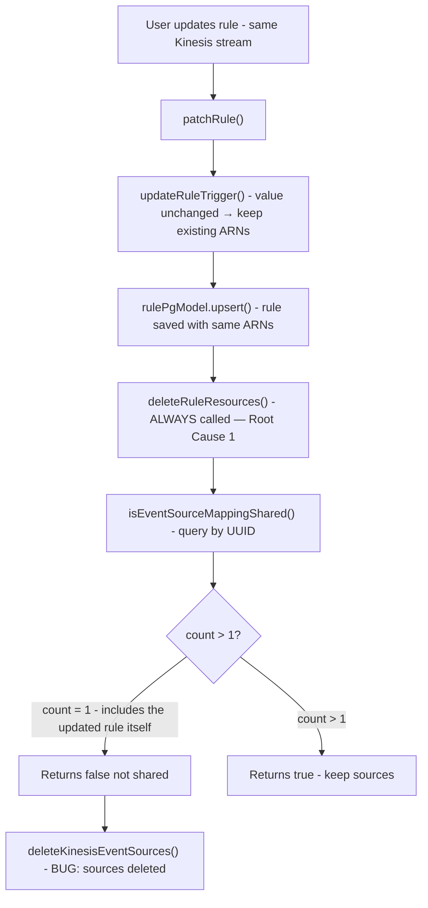

# CUMULUS-4000: Bug Investigation

## Background

### Event Source Mappings

An event source mapping is an AWS Lambda configuration that connects a stream to a Lambda function. When messages arrive in the stream, the mapping automatically invokes the Lambda with the messages.

When updating a rule that references a Kinesis stream the existing event source mappings should be preserved if the stream itself hasn't changed. The current implementation unconditionally deletes and recreates these mappings.

## Problem

Users of the dashboard were updating a rule and noticing that the event source mapping was being deleted in certain scenerios.

When updating a Cumulus rule that references a Kinesis stream, the event source mappings (Lambda handlers) are incorrectly deleted when:

1. Only one rule uses that Kinesis stream, AND
2. The update does not change the stream (ex. changing metadata)

This silently breaks data ingestion and messages in the stream no longer trigger workflows.

## Two Root Causes

Values in a rule can be updated that should not effect the event source mapping. `[packages/api/lib/schemas.js](packages/api/lib/schemas.js#L445-L565)`

Example of event mapping: `[packages/api/lib/rulesHelpers.js](packages/api/lib/rulesHelpers.js#L276-L291)` — defines the `kinesisSourceEvents` array that maps Lambda functions (`messageConsumer`, `KinesisInboundEventLogger`) to their event source ARNs (`arn`, `log_event_arn`).

### Root Cause 1 — Unconditional deletion on update

In `[packages/api/endpoints/rules.js](packages/api/endpoints/rules.js#L144-L176)`, `patchRule()` always calls `deleteRuleResources()` at lines 172-174 for kinesis/SNS rules regardless of whether the stream changed:

```javascript
// lines 172-174 — always called, even when value is unchanged
if (['kinesis', 'sns'].includes(oldApiRule.rule.type)) {
  await deleteRuleResources(knex, oldApiRule);
}
```

### Root Cause 2 — Sharing check uses Lambda UUID, not stream value

In `[packages/api/lib/rulesHelpers.js](packages/api/lib/rulesHelpers.js#L229-L239)`, `isEventSourceMappingShared()` queries by event source UUID (`arn` / `log_event_arn`), not by the stream value (`rule.value`). A rule with a null ARN but the same stream is invisible to this check:

```javascript
// lines 229-239 — current implementation querying by UUID
async function isEventSourceMappingShared(knex, rule, eventType) {
  const params = { type: rule.rule.type, ...eventType }; // { arn: 'uuid-123' }
  const [result] = await rulePgModel.count(knex, [[params]]);
  return (result.count > 1); // threshold > 1 because rule itself is included
}
```

The `eventType` argument is either `{ arn: uuid }` or `{ log_event_arn: uuid }`. If another rule references the same stream but has a null ARN (e.g. after being affected by this very bug), the count will be 0 and events sources will be deleted even though they are still needed.

## Current Bug Flow



## Proposed Fix

We should delete event mappings based on **"does any other rule still need this stream?"** — not **"does another rule share this UUID?"**.

The fix is two changes that work together:

### Change 1 — `valueUpdated` guard in `patchRule`

Only call `deleteRuleResources` when the stream value actually changed (fixes root cause 1)

**File:** `[packages/api/endpoints/rules.js](packages/api/endpoints/rules.js#L144-L176)` — `patchRule()` function

**Calls:**
- `updateRuleTrigger()` — `[packages/api/lib/rulesHelpers.js](packages/api/lib/rulesHelpers.js#L667-L711)`
- `deleteRuleResources()` — `[packages/api/lib/rulesHelpers.js](packages/api/lib/rulesHelpers.js#L344-L369)`

```javascript
// Compute before updateRuleTrigger
const valueUpdated = oldApiRule.rule.value !== apiRule.rule.value;

const apiRuleWithTrigger = await updateRuleTrigger(oldApiRule, apiRule);

// Only call deleteRuleResources when the stream/topic actually changed
if (valueUpdated && ['kinesis', 'sns'].includes(oldApiRule.rule.type)) {
  await deleteRuleResources(knex, oldApiRule);
}
```

### Change 2 — Rewrite `isEventSourceMappingShared` to query by stream value

Replace the UUID-based query with a value based query that excludes the current rule by name. This eliminates root cause 2 and simplifies the function.

**File:** `[packages/api/lib/rulesHelpers.js](packages/api/lib/rulesHelpers.js#L229-L239)` — `isEventSourceMappingShared()` function

```javascript
// Before: queries by UUID, counts self, threshold > 1
async function isEventSourceMappingShared(knex, rule, eventType) { ... }

// After: queries by stream value, excludes self by name, threshold > 0
async function isEventSourceMappingShared(knex, rule) {
  const [result] = await knex('rules')
    .where({ type: rule.rule.type, value: rule.rule.value })
    .whereNot({ name: rule.name })
    .count('* as count');
  return (Number(result.count) > 0);
}
```

The check `> 0` instead of `> 1` to  because the current rule is now excluded by name rather than being incidentally counted.

**Update callers** to drop the now-removed `eventType` argument:

- `deleteKinesisEventSource()` — `[packages/api/lib/rulesHelpers.js](packages/api/lib/rulesHelpers.js#L250-L260)` called from `deleteKinesisEventSources()` at lines 292-298 (both calls now ask the same stream-level question, which is correct since `messageConsumer` and `KinesisInboundEventLogger` mappings are always managed together)
- `deleteSnsTrigger()` — `[packages/api/lib/rulesHelpers.js](packages/api/lib/rulesHelpers.js#L311-L337)` (currently passes `{ arn: rule.rule.arn }` at line 313)