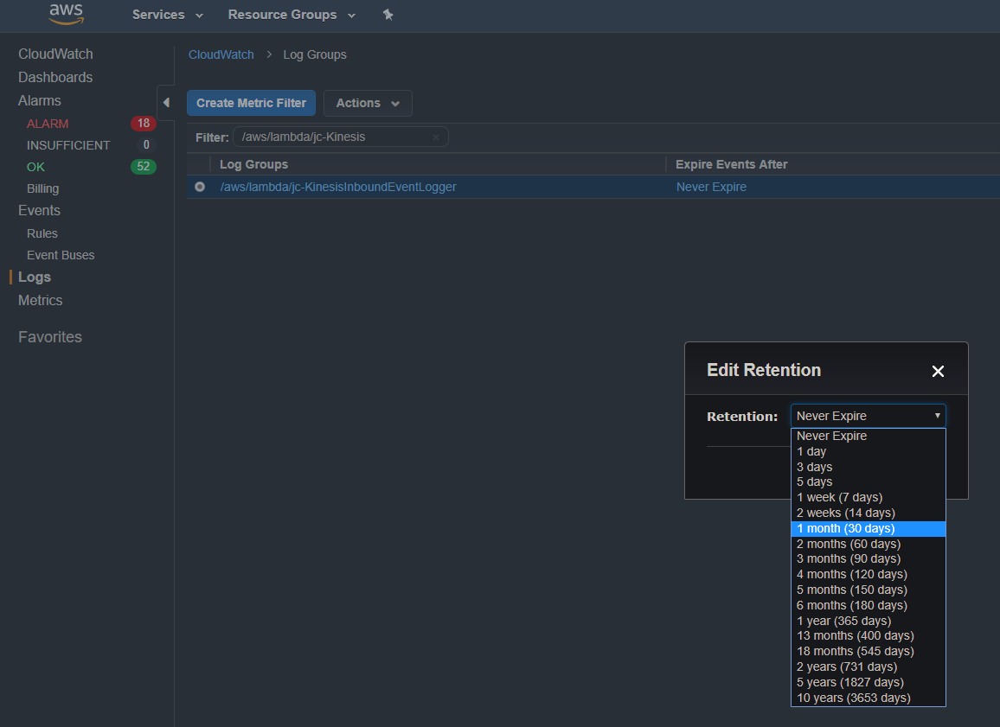

Our lambdas dump logs to [AWS CloudWatch](https://aws.amazon.com/cloudwatch/). By default, these logs exist indefinitely. However, there are ways to specify a duration for log retention.

## aws-cli

In addition to getting your aws-cli [set-up](https://docs.aws.amazon.com/cli/latest/userguide/cli-chap-getting-started.html), there are two values you'll need to acquire.

1. `log-group-name`: the name of the log group who's retention policy (retention time) you'd like to change. We'll use `/aws/lambda/KinesisInboundLogger` in our examples.
2. `retention-in-days`: the number of days you'd like to retain the logs in the specified log group for. There is a list of possible values available in the [aws logs documentation](https://docs.aws.amazon.com/cli/latest/reference/logs/put-retention-policy.html).

For example, if we wanted to set log retention to 30 days on our `KinesisInboundLogger` lambda, we would write:

```bash
aws logs put-retention-policy --log-group-name "/aws/lambda/KinesisInboundLogger" --retention-in-days 30
```

**Note:** The aws-cli log command that we're using is explained in detail [here](https://docs.aws.amazon.com/cli/latest/reference/logs/put-retention-policy.html).

## AWS Management Console

Changing the log retention policy in the AWS Management Console is a fairly simple process:

1. Navigate to the CloudWatch service in the AWS Management Console.
2. Click on the `Logs` entry on the sidebar.
3. Find the Log Group who's retention policy you're interested in changing.
4. Click on the value in the `Expire Events After` column.
5. Enter/Select the number of days you'd like to retain logs in that log group for.



## Terraform

Cumulus modules create cloudwatch log groups and manage log retention for a subset of lambdas and tasks. These log groups have a default log retention time, but, there are two optional variables which can be set to change the default retention period for all or specific Cumulus managed cloudwatch log groups through deployment. For cloudwatch log groups which are not managed by Cumulus modules, the retention period is indefinite or `Never Expire` by AWS, cloudwatch log configurations for all Cumulus lambdas and tasks will be added in a future release.

There are optional variables that can be set during deployment of cumulus modules to configure
the retention period (in days) of cloudwatch log groups for lambdas and tasks which the `cumulus`, `cumulus_distribution`, and `cumulus_ecs_service` modules supports (using the `cumulus` module as an example):

```tf
module "cumulus" {
  # ... other variables
  default_log_retention_days = var.default_log_retention_days
  cloudwatch_log_retention_periods = var.cloudwatch_log_retention_periods
}
```

By setting the below variables in `terraform.tfvars` and deploying, the cloudwatch log groups will be instantiated or updated with the new retention value.

### default_log_retention_periods

The variable `default_log_retention_days` can be configured in order to set the default log retention for all cloudwatch log groups managed by Cumulus in case a custom value isn't used. The log groups will use this value for their retention, and if this value is not set either, the retention will default to 30 days. For example, if a user would like their log groups of the Cumulus module to have a retention period of one year, deploy the respective modules with the variable in the example below.

#### Example

```tf
default_log_retention_periods = 365
```

### cloudwatch_log_retention_periods

The retention period (in days) of cloudwatch log groups for specific lambdas and tasks can be set
during deployment using the `cloudwatch_log_retention_periods` terraform map variable. In order to
configure these values for respective cloudwatch log groups, uncomment the `cloudwatch_log_retention_periods` variable and add the retention values listed below corresponding to the group's retention you want to change. The following values are supported correlating to their lambda/task name, (i.e. "/aws/lambda/prefix-DiscoverPdrs" would have the retention variable "DiscoverPdrs" )

- ApiEndpoints
- AsyncOperationEcsLogs
- DiscoverPdrs
- DistributionApiEndpoints
- EcsLogs
- granuleFilesCacheUpdater
- HyraxMetadataUpdates
- ParsePdr
- PostToCmr
- PrivateApiLambda
- publishExecutions
- publishGranules
- publishPdrs
- QueuePdrs
- QueueWorkflow
- replaySqsMessages
- SyncGranule
- UpdateCmrAccessConstraints

#### Example

```tf
cloudwatch_log_retention_periods = {
  ParsePdr = 365
}
```

The retention periods are the number of days you'd like to retain the logs in the specified log group for. There is a list of possible values available in the [aws logs documentation](https://docs.aws.amazon.com/cli/latest/reference/logs/put-retention-policy.html).
