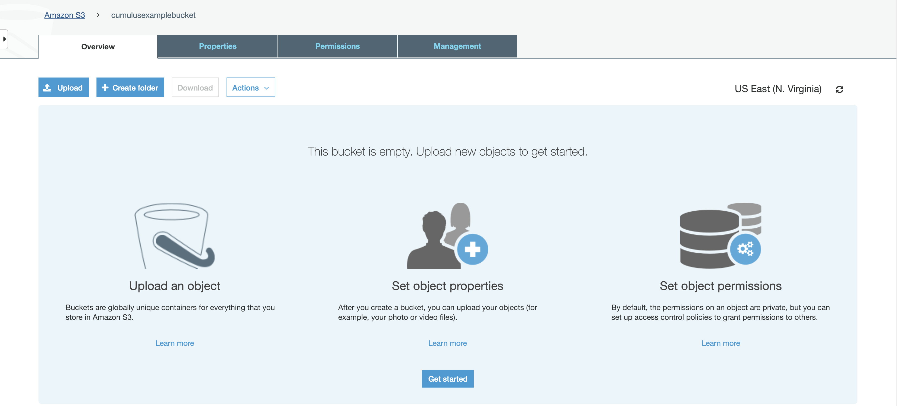
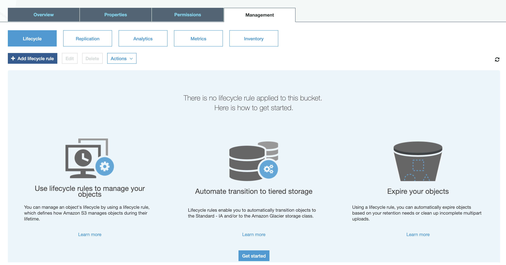
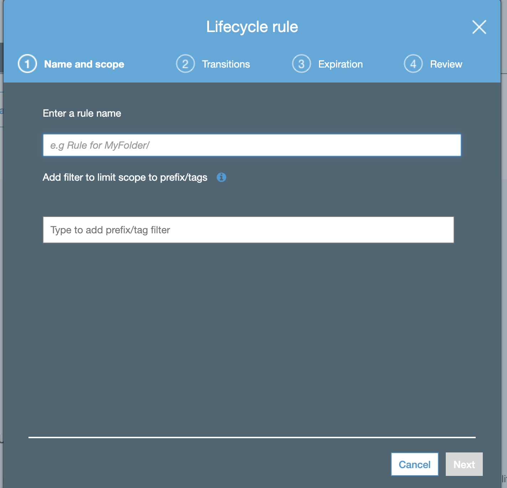
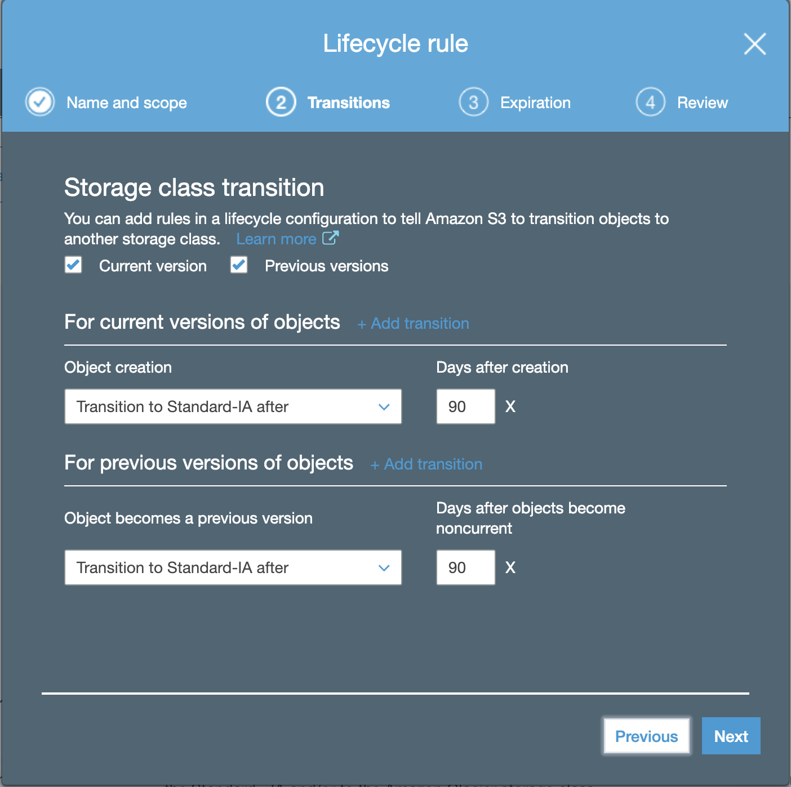
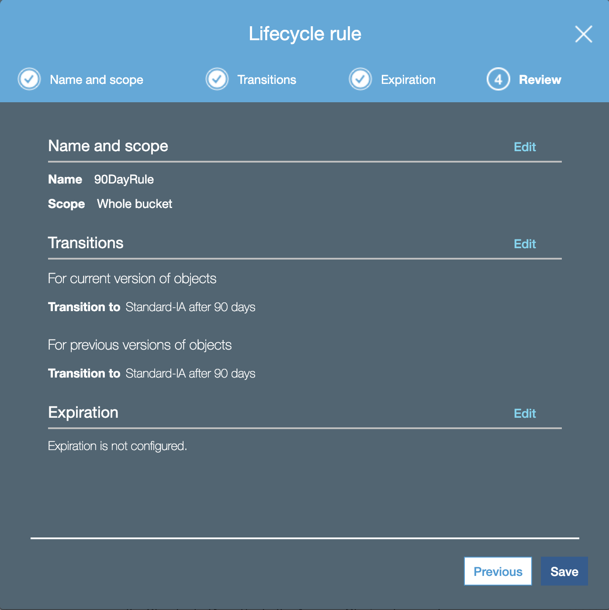
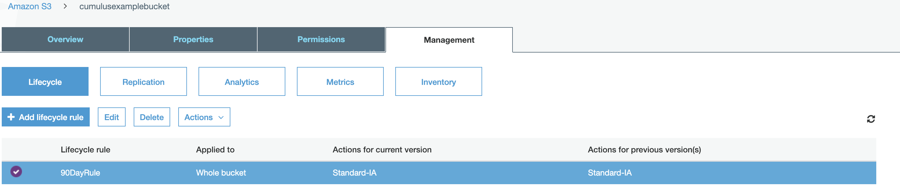

This document will outline, in brief, how to set data lifecycle policies so that you are more easily able to control data storage costs while keeping your data accessible.   For more information on why you might want to do this, see the 'Additional Information' section at the end of the document.

## Requirements

* The AWS CLI installed and configured (if you wish to run the CLI example).  See [AWS's guide to setting up the AWS CLI](https://docs.aws.amazon.com/AmazonS3/latest/dev/setup-aws-cli.html) for more on this.   Please ensure the AWS CLI is in your shell path.
* You will need a S3 bucket on AWS. ***You are strongly encouraged to use a bucket without voluminous amounts of data in it for experimenting/learning***.
* An AWS user with the appropriate roles to access the target bucket as well as modify bucket policies.

## Examples

### Walk-through on setting time-based S3 Infrequent Access (S3IA) bucket policy

This example will give step-by-step instructions on updating a bucket's lifecycle policy to move all objects in the bucket from the default storage to S3 Infrequent Access (S3IA) after a period of 90 days.   Below are instructions for walking through configuration via the command line and the management console.

### Command Line

:::caution

Please ensure you have the AWS CLI installed and configured for access prior to attempting this example.

:::

#### Create policy

From any directory you chose, open an editor and add the following to a file named `exampleRule.json`

```bash
{
    "Rules": [
        {
          "Status": "Enabled",
          "Filter": {
            "Prefix": ""
          },
          "Transitions": [
            {
              "Days": 90,
              "StorageClass": "STANDARD_IA"
            }
          ],
          "NoncurrentVersionTransitions": [
            {
              "NoncurrentDays": 90,
              "StorageClass": "STANDARD_IA"
            }
          ]
          "ID": "90DayS3IAExample"
        }
    ]
}
```

#### Set policy

On the command line run the following command (with the bucket you're working with substituted in place of yourBucketNameHere).

```bash
aws s3api put-bucket-lifecycle-configuration --bucket yourBucketNameHere --lifecycle-configuration file://exampleRule.json
```

#### Verify policy has been set

To obtain all of the existing policies for a bucket, run the following command (again substituting the correct bucket name):

```bash
 $ aws s3api get-bucket-lifecycle-configuration --bucket yourBucketNameHere
  {
      "Rules": [
          {
              "Status": "Enabled",
              "Filter": {
                  "Prefix": ""
              },
              "Transitions": [
              {
                      "Days": 90,
                      "StorageClass": "STANDARD_IA"
                  }
              ],
              "NoncurrentVersionTransitions": [
                  {
                      "NoncurrentDays": 90,
                      "StorageClass": "STANDARD_IA"
                  }
              ]
              "ID": "90DayS3IAExample"
          }
      ]
  }
```

You have set a policy that transitions any version of an object in the bucket to S3IA after each object version has not been modified for 90 days.

### Management Console

#### Create Policy

To create the example policy on a bucket via the management console, go to the following URL (replacing 'yourBucketHere' with the bucket you intend to update):

`https://s3.console.aws.amazon.com/s3/buckets/yourBucketHere/?tab=overview`

You should see a screen similar to:



Click the "Management" Tab, then lifecycle button and press `+ Add lifecycle rule`:



Give the rule a name (e.g. '90DayRule'), leaving the filter blank:



Click `next`, and mark `Current Version` and `Previous Versions`.

Then for each, click `+ Add transition` and select `Transition to Standard-IA after` for the `Object creation` field, and set `90` for the `Days after creation`/`Days after objects become concurrent` field.    Your screen should look similar to:



Click `next`, then next past the `Configure expiration` screen (we won't be setting this), and on the fourth page, click `Save`:



You should now see you have a rule configured for your bucket:



You have now set a policy that transitions any version of an object in the bucket to S3IA after each object has not been modified for 90 days.

## Configuring S3 Lifecycle Rules via Terraform

Cumulus supports configuring S3 lifecycle expiration rules for the system bucket directly through Terraform using the `aws_s3_system_bucket_lifecycle_rules` variable. This replaces any previously hardcoded lifecycle rule configuration with a flexible, user-defined list of rules that are applied dynamically at deploy time.

### How to Configure Rules

You can define your rules in the cumulus module by adding an `aws_s3_system_bucket_lifecycle_rules` block, which is just a list of the rules you want to apply.

Each rule in the list needs four simple pieces of information:

* `id`: `string`, A unique identifier for the lifecycle rule. Will be prefixed with your deployment `prefix` (e.g. `myprefix_my_rule`).
* `prefix`: `string`, A unique prefix for the lifecycle rule. Depending on the `prepend_prefix` setting, this value is either prepended with your deployment `prefix` (e.g., `myprefix_my_rule`) or used as provided.
* `days`: `number`, Number of days after object creation before the object expires and is moved or deleted.
* `prepend_prefix`: `bool`, Whether to prepend deployment `prefix` to the prefix rule.
* `status`: `string`, Whether the rule is active. Use `"Enabled"` or `"Disabled"`

**Example:**

```hcl
aws_s3_system_bucket_lifecycle_rules = [
  {
    id     = "internal_file-staging_expiration_rule"
    prefix = "file-staging/"
    days   = 31
    prepend_prefix = false
    status = "Disabled"
  },
  {
    id     = "internal_dead-letter-archive_expiration_rule"
    prefix = "/dead-letter-archive/"
    days   = 89
    prepend_prefix = true
    status = "Enabled"
  },
  {
    id     = "internal_events_expiration_rule"
    prefix = "events/"
    days   = 90
    prepend_prefix = false
    status = "Enabled"
  }
]
```

Given a deployment with `prefix = "myprefix"`, the above configuration produces three lifecycle rules on the system bucket:

| Effective Rule ID | Effective Prefix | Expires After | Effective Status
|---|---|---|---|
| `myprefix_internal_file-staging_expiration_rule` | `file-staging/` | 31 days | `Disabled` |
| `myprefix_internal_dead-letter-archive_expiration_rule` | `myprefix/dead-letter-archive/` | 89 days | `Enabled` |
| `myprefix_internal_events_expiration_rule` | `events/` | 90 days | `Enabled` |

:::note

If you do not set `aws_s3_system_bucket_lifecycle_rules` in your `terraform.tfvars`, the module uses the default rule.  This remains unchanged from previous releases, which expires objects under the `<prefix>/data/execution-status/` prefix after 1 day.

:::

## Additional Information

This section lists information you may want prior to enacting lifecycle policies.  It is not required content for working through the examples.

### Strategy Overview

For a discussion of overall recommended strategy, please review the [Methodology for Data Lifecycle Management](https://wiki.earthdata.nasa.gov/display/CUMULUS/Methodology+for+Data+Lifecycle+Management) on the EarthData wiki.

### AWS Documentation

The examples shown in this document are obviously fairly basic cases.  By using object tags, filters and other configuration options  you can enact far more complicated policies for various scenarios. For more reading on the topics presented on this page see:

* [AWS - Guide on setting bucket lifecycle policies via the management Console](https://docs.aws.amazon.com/AmazonS3/latest/user-guide/create-lifecycle.html)
* [AWS - Guide on setting bucket lifecycle policies using the AWS CLI](https://docs.aws.amazon.com/AmazonS3/latest/dev/set-lifecycle-cli.html)
* [AWS - Object Lifecycle Management](https://docs.aws.amazon.com/AmazonS3/latest/dev/object-lifecycle-mgmt.html)
* [AWS - Lifecycle Configuration Examples](https://docs.aws.amazon.com/AmazonS3/latest/dev/lifecycle-configuration-examples.html)
