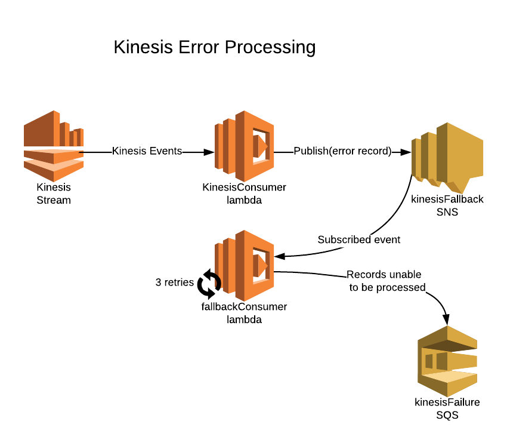

# CNM Workflow

This entry documents setup of a basic workflow that utilizes the built-in CNM/Kinesis functionality in Cumulus.

Prior to working through this entry you should be familiar with the [Cloud Notification Mechanism](https://wiki.earthdata.nasa.gov/display/CUMULUS/Cloud+Notification+Mechanism).

## Prerequisites

#### Cumulus

This entry assumes you have a deployed instance of Cumulus (>= version 1.8).

#### AWS CLI

This entry assumes you have the [AWS CLI](https://aws.amazon.com/cli/) installed and configured. If you do not, please take a moment to review the documentation - particularly the [examples relevant to Kinesis](https://docs.aws.amazon.com/streams/latest/dev/fundamental-stream.html) - and install it now.

#### Kinesis

This entry assumes you already have two [Kinesis](https://aws.amazon.com/kinesis/) data steams created for use as CNM notification and response data streams.

If you do not have two streams setup, please take a moment to review the [Kinesis documentation](https://aws.amazon.com/documentation/kinesis/) and setup two basic single-shard streams for this example:

Using the "Create Data Stream" button on the [Kinesis Dashboard](https://console.aws.amazon.com/kinesis/home), work through the dialogue.

You should be able to quickly use the "Create Data Stream" button on the [Kinesis Dashboard](https://console.aws.amazon.com/kinesis/home), and setup streams that are similar to the following example:


Please bear in mind that your `${stackname}-lambda-processing` IAM role will need permissions to write to the response stream for this workflow to succeed if you create the Kinesis stream with a dashboard user.   If you are using the example deployment (or a deployment based on it), the IAM permissions should be set properly.

If not, the most straightforward approach is to attach the `AmazonKinesisFullAccess` policy for the stream resource to whatever role your lambdas are using, however your environment/security policies may require an approach specific to your deployment environment.

In operational environments it's likely science data providers would typically be responsible for providing a Kinesis stream with the appropriate permissions.

For more information on how this process works and how to develop a process that will add records to a stream, read the [Kinesis documentation](https://aws.amazon.com/documentation/kinesis/) and the [developer guide](https://docs.aws.amazon.com/streams/latest/dev/introduction.html).

#### Source Data

This entry will run the SyncGranule task against a single target data file.  To that end it will require a single data file to be present in an S3 bucket matching the Provider configured in the next section.

#### Collection and Provider

Cumulus will need to be configured with a Collection and Provider entry of your choosing.  The provider should match the location of the source data from the `Ingest Source Data` section.

This can be done via the [Cumulus Dashboard](https://github.com/nasa/cumulus-dashboard) if installed or the [API](../api.md).  It is strongly recommended to use the dashboard if possible.

## Cumulus Configuration

Provided the prerequisites have been fulfilled, you can begin adding the needed values to your Cumulus configuration to configure the example workflow.

The following are steps that are required to set up your Cumulus instance to run the example workflow:

#### Example CNM Workflow Configuration

In this example, we're going to trigger a workflow by creating a kinesis rule and sending a record to a kinesis stream.

The following [workflow definition](../workflows/README.md) should be added to your deployment's `workflows.yml`. 

Update the `CNMResponseStream` key in the `CnmResponse` task to match the name of the Kinesis response stream you configured in the prerequisites section.

```yaml
CNMExampleWorkflow:
  Comment: CNMExampleWorkflow
  StartAt: StartStatus
  States:
    StartStatus:
      Type: Task
      Resource: ${SfSnsReportLambdaFunction.Arn}
      CumulusConfig:
        cumulus_message:
          input: '{$}'
      Next: TranslateMessage
      Catch:
        - ErrorEquals:
          - States.ALL
          ResultPath: '$.exception'
          Next: CnmResponse
    TranslateMessage:
      Type: Task
      Resource: ${CNMToCMALambdaFunction.Arn}
      CumulusConfig:
        cumulus_message:
          outputs:
            - source: '{$.cnm}'
              destination: '{$.meta.cnm}'
            - source: '{$}'
              destination: '{$.payload}'
      Catch:
        - ErrorEquals:
          - States.ALL
          ResultPath: '$.exception'
          Next: CnmResponse
      Next: SyncGranule
    SyncGranule:
      CumulusConfig:
        provider: '{$.meta.provider}'
        buckets: '{$.meta.buckets}'
        collection: '{$.meta.collection}'
        downloadBucket: '{$.meta.buckets.private.name}'
        stack: '{$.meta.stack}'
        cumulus_message:
          outputs:
            - source: '{$.granules}'
              destination: '{$.meta.input_granules}'
            - source: '{$}'
              destination: '{$.payload}'
      Type: Task
      Resource: ${SyncGranuleLambdaFunction.Arn}
      Retry:
        - ErrorEquals:
            - States.ALL
          IntervalSeconds: 10
          MaxAttempts: 3
      Catch:
        - ErrorEquals:
          - States.ALL
          ResultPath: '$.exception'
          Next: CmrResponse
      Next: CnmResponse
    CnmResponse:
      CumulusConfig:
        OriginalCNM: '{$.meta.cnm}'
        CNMResponseStream: 'ADD YOUR RESPONSE STREAM HERE'
        region: 'us-east-1'
        WorkflowException: '{$.exception}'
        cumulus_message:
          outputs:
            - source: '{$}'
              destination: '{$.meta.cnmResponse}'
      Type: Task
      Resource: ${CnmResponseLambdaFunction.Arn}
      Retry:
        - ErrorEquals:
            - States.ALL
          IntervalSeconds: 5
          MaxAttempts: 3
      Catch:
        - ErrorEquals:
          - States.ALL
          ResultPath: '$.exception'
          Next: StopStatus
      Next: StopStatus
    StopStatus:
      Type: Task
      Resource: ${SfSnsReportLambdaFunction.Arn}
      CumulusConfig:
        sfnEnd: true
        stack: '{$.meta.stack}'
        bucket: '{$.meta.buckets.internal.name}'
        stateMachine: '{$.cumulus_meta.state_machine}'
        executionName: '{$.cumulus_meta.execution_name}'
        cumulus_message:
          input: '{$}'
      Catch:
        - ErrorEquals:
          - States.ALL
          Next: WorkflowFailed
      End: true
    WorkflowFailed:
      Type: Fail
      Cause: 'Workflow failed'

```

Again, please make sure to modify the value CNMResponseStream to match the stream name (not ARN) for your Kinesis response stream.

#### Task Configuration

The following tasks are required to be defined in the `lambdas.yml` configuration file.

If you're using a deployment based on the [example deployment](https://github.com/nasa/cumulus/tree/master/example) configuration these lambdas should already be defined for you.

###### CNMToCMA

The example workflow assumes you have a CNM to Cumulus Message Adapter (CMA) translation lambda defined in the `lambdas.yml` configuration file as `CNMToCMA`:

```yaml
CNMToCMA:
  handler: 'gov.nasa.cumulus.CnmToGranuleHandler::handleRequestStreams'
  timeout: 300
  runtime: java8
  memory: 128
  s3Source:
    bucket: 'cumulus-data-shared'
    key: 'daacs/podaac/cnmToGranule-1.0-wCMA.zip'
  useMessageAdapter: false
  launchInVpc: true
```

`CNMToCMA` is meant for the begining of a workflow: it will extract CMA-compatible granule information into the payload. This workflow will not utilize that payload. For other workflows, you would need to ensure that downstream tasks in your workflow either understand the CNM message *or* include a translation task like this one.

You can also manipulate the data sent to downstream tasks using the `CumulusConfig` definitions for various states in `workflows.yml`. Read more about how to configure data on the [Workflow Input & Output](https://nasa.github.io/cumulus/workflows/input_output.html) page.

###### CnmResponse

The workflow defined above assumes a CNM response task defined in the `lambdas.yml` configuration file. Example:

```
CnmResponse:
  handler: 'gov.nasa.cumulus.CNMResponse::handleRequestStreams'
  timeout: 300
  useMessageAdapter: false
  runtime: java8
  memory: 256
  s3Source:
    bucket: 'cumulus-data-shared''
    key: 'daacs/podaac/cnmResponse-1.0.zip'
  launchInVpc: true
```

The `CnmResponse` lambda generates a CNM response message and puts it on a the `CNMResponseStream` kinesis stream.

The `CnmResponse` lambda package is provided (as of release 1.8) in the `cumulus-data-shared` bucket, with documentation provided in the [source repository](https://git.earthdata.nasa.gov/projects/POCUMULUS/repos/cnmresponsetask/browse).


###### Additional Tasks

Lastly, this entry also includes the tasks  `SfSnsReport`, `SyncGranule` from the [example deployment](https://github.com/nasa/cumulus/tree/master/example) are defined in the `lambdas.yml`.

### Redeploy

Once the above configuration changes have been made, redeploy your stack.

Please refer to `Updating Cumulus deployment` in the [deployment documentation](../deployment/README.md) if you are unfamiliar with that process.

### Rule Configuration

`@cumulus/api` includes a `kinesisConsumer` lambda function ([kinesis-consumer](https://github.com/nasa/cumulus/blob/master/packages/api/lambdas/kinesis-consumer.js)). Cumulus kinesis-type rules create the [event source mappings](https://docs.aws.amazon.com/lambda/latest/dg/API_CreateEventSourceMapping.html) between kinesis streams and the `kinesisConsumer` lambda. The `kinesisConsumer` lambda consumes records from one or more kinesis streams, as defined by enabled kinesis rules. When new records are pushed to one of these streams, the `kinesisConsumer` triggers workflows associated with the enabled kinesis-type rules.

To add a rule via the dashboard (if you'd like to use the API, see the docs [here](https://nasa.github.io/cumulus-api/#create-rule), navigate to the `Rules` page and click `Add a rule`, then configure the new rule using the following template (substituting correct values for parameters denoted by `${}`:

```
name: cnm_basic_rule
Workflow Name: CNMExampleWorkflow
Provider ID: ${provider_id} # found on the Providers page
collection - Collection Name: ${collection_name} # configured and found in the Collections page
collection - Collection Version: ${collection_version} # configured and found in the Collections page
rule - type: kinesis
rule - value: ${Kinesis_Stream_ARN} # Kinesis notification stream ARN goes here.
Rule State: ENABLED
Optional tags for search:
```

**Please Note:**

- The rule - value key must match the Amazon resource name [ARN](https://docs.aws.amazon.com/general/latest/gr/aws-arns-and-namespaces.html) for the Kinesis data stream you've preconfigured.   You should be able to obtain this ARN from the Kinesis Dashboard entry for the selected stream.
- The collection and provider should match the collection and provider you setup in the `Prerequisites` section.

Once you've clicked on 'submit' a new rule should appear in the dashboard Rule Overview.


## Execution

Once Cumulus has been configured and a rule has been added, we're ready to trigger the workflow and watch it execute.

### Triggering the Workflow

To trigger matching workflows, you will need to put a record on the Kinesis stream that the [kinesis-consumer](https://github.com/nasa/cumulus/blob/master/packages/api/lambdas/kinesis-consumer.js) lambda will recognize as a matching event. Most importantly, it should include a `collection` key / value pair that matches a valid collection.

For the purpose of this example, the easiest way to accomplish this is using the [AWS CLI](https://aws.amazon.com/cli/).

#### Notification JSON

Construct a JSON file containing an object that matches the values that have been previously setup.  This JSON object should be a valid [Cloud Notification Mechanism](https://wiki.earthdata.nasa.gov/display/CUMULUS/Cloud+Notification+Mechanism) message.

**Please note**: *this example is somewhat contrived, as the downstream tasks don't care about most of these fields.  A 'real' data ingest workflow would.*

The following values (denoted by ${} in the sample below) should be replaced to match values we've previously configured:

-  TEST_DATA_FILE_NAME:  The filename of the test data that is available in the S3 (or other) provider we created earlier.
-  TEST_DATA_URI: The full S3 path to the test data (e.g. s3://bucket-name/path/granule)
-  COLLECTION:  The collection defined in the prerequisites for this product

```
{
  "product": {
    "files": [
      {
        "checksum-type": "md5",
        "name": "${TEST_DATA_FILE_NAME}",
        "checksum": "bogus_checksum_value",
        "uri": "${TEST_DATA_URI}",
        "type": "data",
        "size": 12345678
      }
    ],
    "name": "TEST_DATA",
    "dataVersion": "006"
  },
  "identifier ": "testIdentifier123456",
  "collection": "${COLLECTION}",
  "provider": "TestProvider",
  "version": "001"
}
```

#### Add Record to Kinesis Data Stream

Using the JSON file you created, push it to the Kinesis notification stream:

```
aws kinesis put-record --stream-name YOUR_KINESIS_NOTIFICATION_STREAM_NAME_HERE --partition-key 1 --data file:///path/to/file.json
```

**Please note**: The above command uses the stream name, *not* the ARN.


The command should return output similar to:
```
{
    "ShardId": "shardId-000000000000",
    "SequenceNumber": "42356659532578640215890215117033555573986830588739321858"
}
```

This command will put a record containing the JSON value from the `--data` flag onto the Kinesis data stream, which should be picked up by Cumulus.  This will trigger the CNMExampleWorkflow workflow targeted by the rule you previously configured.

You can view the current running executions on the `Executions` dashboard page which presents a list of all executions, their status (running, failed, or completed), to which workflow the execution belongs, along with other information.

### Process

Once the message is added to the Kinesis Stream, the rule we previously defined will cause Cumulus to read the new entry on the stream, validate the data is a CNM JSON object, and each kinesis-type rule associated with the collection and kinesis strea will trigger the associated workflow, passing the CNM object in as as source data to the first task in the workflow.

In our example, the rule should trigger `CNMExampleWorkflow` .

#### StartStatus

The first task in the execution will report to Cumulus that the workflow has started execution and pass the CNM message to the next step in the workflow

#### TranslateMessage

`TranslateMessage` will take the CNM object payload and add a granules object to the CMA payload that's consistent with other Cumulus Ingest tasks, and add a key 'cnm' to 'meta' (as well as the payload) to store the original message.

*For more on the Message Adapter, please see [the Message Flow documentation](../workflows/cumulus-task-message-flow.md)*.

An example of what is happening in the Translation step follows:

Example Input Payload:

```json
"payload": {
    "identifier ": "testIdentifier123456",
    "product": {
      "files": [
        {
          "checksum-type": "md5",
          "name": "MOD09GQ.A2016358.h13v04.006.2016360104606.hdf",
          "checksum": "bogus_checksum_value",
          "uri": "s3://some_bucket/cumulus-test-data/pdrs/MOD09GQ.A2016358.h13v04.006.2016360104606.hdf",
          "type": "data",
          "size": 12345678
        }
      ],
      "name": "TestGranuleUR",
      "dataVersion": "006"
    },
    "version": "123456",
    "collection": "MOD09GQ",
    "provider": "TestProvider"
  },
```

Example Output Payload:

```json
  "payload": {
    "cnm": {
      "identifier ": "testIdentifier123456",
      "product": {
        "files": [
          {
            "checksum-type": "md5",
            "name": "MOD09GQ.A2016358.h13v04.006.2016360104606.hdf",
            "checksum": "bogus_checksum_value",
            "uri": "s3://some-bucket/cumulus-test-data/data/MOD09GQ.A2016358.h13v04.006.2016360104606.hdf",
            "type": "data",
            "size": 12345678
          }
        ],
        "name": "TestGranuleUR",
        "dataVersion": "006"
      },
      "version": "123456",
      "collection": "MOD09GQ",
      "provider": "TestProvider"
    },
    "granules": [
      {
        "granuleId": "TestGranuleUR",
        "files": [
          {
            "path": "some-bucket/data",
            "url_path": "s3://some-bucket/cumulus-test-data/data/MOD09GQ.A2016358.h13v04.006.2016360104606.hdf",
            "bucket": "some-bucket",
            "name": "MOD09GQ.A2016358.h13v04.006.2016360104606.hdf",
            "size": 12345678
          }
        ]
      }
    ]
  }
```


#### SyncGranules

This lambda will take the files listed for the granule in the payload and move them to `s3://{deployment-private-bucket}/file-staging/{deployment-name}/{COLLECTION}/{file_name}`

#### CnmResponse

Assuming a successful execution of the workflow, this task will recover the 'cmr' key from the 'meta' portion of the CMA output, and add a 'SUCCESS' record to the notification Kinesis stream.

If a prior step in the the workflow has directed a failure to this step, the this will add a "FAILURE" record to the stream instead.

Note the `CnmResponse` state defined in the `workflows.yml` above configures `$.exception` to be passed to the `CnmResponse` lambda keyed under `config.WorkflowException`. This is required for the `CnmResponse` code to correctly interpret the failure.

#### StopStatus

In case of either success *or* failure, CnmResponse will then pass the results to StopStatus and it will react as it would in any other workflow in case of success or failure.

## Results

Following the successful execution of this workflow, you should expect to see the workflow complete successfully on the Dashboard:


The test granule you added to the notification Kinesis stream should be moved to the deployment's private staging area, and a SUCCESSFUL notification should be present on the Response Kinesis stream.


You should be able to validate the notification stream has records with the following steps (the AWS CLI Kinesis [Basic Stream Operations](https://docs.aws.amazon.com/streams/latest/dev/fundamental-stream.html) is useful to review before proceeding):

- Get a shard iterator (substituting your stream name as appropriate):

```
aws kinesis get-shard-iterator --shard-id shardId-000000000000 --shard-iterator-type LATEST --stream-name NOTIFICATION_STREAM_NAME_HERE
```

which should result in an output to:

```
{
    "ShardIterator": "VeryLongString=="
}
```
- Re-trigger the workflow by using the `put-record` command from
- As the workflow completes the input from the get-shard-iterator command to request data from the stream:

```
aws kinesis get-records --shard-iterator SHARDITERATORVALUEHERE
```

This should result in output similar to:

```
{
    "Records": [
        {
            "SequenceNumber": "49586720336541656798369548102057798835250389930873978882",
            "ApproximateArrivalTimestamp": 1532664689.128,
            "Data": "eyJpZGVudGlmaWVyICI6InRlc3RJZGVudGlmaWVyMTIzNDU2IiwidmVyc2lvbiI6IjAwNiIsImNvbGxlY3Rpb24iOiJNT0QwOUdRIiwicHJvdmlkZXIiOiJUZXN0UHJvdmlkZXIiLCJwcm9kdWN0U2l6ZSI6MTkwODYzNS4wLCJyZXNwb25zZSI6eyJzdGF0dXMiOiJTVUNDRVNTIn0sInByb2Nlc3NDb21wbGV0ZVRpbWUiOiIyMDE4LTA3LTI3VDA0OjExOjI4LjkxOSJ9",
            "PartitionKey": "1"
        },
        {
            "SequenceNumber": "49586720336541656798369548102059007761070005796999266306",
            "ApproximateArrivalTimestamp": 1532664707.149,
            "Data": "eyJpZGVudGlmaWVyICI6InRlc3RJZGVudGlmaWVyMTIzNDU2IiwidmVyc2lvbiI6IjAwNiIsImNvbGxlY3Rpb24iOiJNT0QwOUdRIiwicHJvdmlkZXIiOiJUZXN0UHJvdmlkZXIiLCJwcm9kdWN0U2l6ZSI6MTkwODYzNS4wLCJyZXNwb25zZSI6eyJzdGF0dXMiOiJTVUNDRVNTIn0sInByb2Nlc3NDb21wbGV0ZVRpbWUiOiIyMDE4LTA3LTI3VDA0OjExOjQ2Ljk1OCJ9",
            "PartitionKey": "1"
        }
    ],
    "NextShardIterator": "AAAAAAAAAAFo9SkF8RzVYIEmIsTN+1PYuyRRdlj4Gmy3dBzsLEBxLo4OU+2Xj1AFYr8DVBodtAiXbs3KD7tGkOFsilD9R5tA+5w9SkGJZ+DRRXWWCywh+yDPVE0KtzeI0andAXDh9yTvs7fLfHH6R4MN9Gutb82k3lD8ugFUCeBVo0xwJULVqFZEFh3KXWruo6KOG79cz2EF7vFApx+skanQPveIMz/80V72KQvb6XNmg6WBhdjqAA==",
    "MillisBehindLatest": 0
}
```
Note that the data encoding is not human readable in the stream and would need to be parsed/converted to be interpretable. There are many options to build a Kineis consumer such as the [KCL](https://docs.aws.amazon.com/streams/latest/dev/developing-consumers-with-kcl.html). For purposes of validating the workflow, it also may be simpler to locate the workflow in the [Step Function Management Console](https://console.aws.amazon.com/states/home) and view the intended output in the cnmResponse key:

```json
    "cnmResponse": {
      "productSize": 12345678,
      "processCompleteTime": "2018-07-27T05:43:41.698",
      "collection": "MOD09GQ",
      "version": "123456",
      "provider": "TestProvider",
      "identifier ": "testIdentifier123456",
      "response": {
        "status": "SUCCESS"
      }
    }
```

## Kinesis Stream Error handling

The default Kinesis stream processing in the Cumulus system is configured for record error tolerance. Kinesis message records that arrive from the stream that are unable to be processed by the `kinesisConsumer` lambda are captured and published to the `kinesisFallback` SNS Topic. The `kinesisFallback` SNS topic broadcasts the record to a subscribed copy of the kinesis consumer lambda named `kinesisFallback`.  This ensures that when a record fails from kinesis, that record is published to the SNS topic, and automatically re-triggered in a fallback attempt to process it.  At this point, the [normal lambda asynchronous invocation retry behavior](https://docs.aws.amazon.com/lambda/latest/dg/retries-on-errors.html) will attempt to process the record 3 mores times.  After this, if the record cannot successfully be processed, it is written to a [dead letter queue](https://docs.aws.amazon.com/AWSSimpleQueueService/latest/SQSDeveloperGuide/sqs-dead-letter-queues.html) `kinesisFailure` SQS where an operator can go to examine the record.  All of this system, the `kinesisFallback` SNS topic, `kinesisConsumer` lambda, and `kinesisFailure` SQS queue come with the API package and do not need to be configured by the operator.




To examine records that were unable to be processed at any step you need to go look at the dead letter queue `{{stackname}}-kinesisFailure`.
Check the [Simple Queue Service (SQS) console](https://console.aws.amazon.com/sqs/home). Select your queue, and under the `Queue Actions` tab, you can choose `View/Delete Messages`. `Start polling` for messages and you will see records that failed to process through the kinesis consumer.  Note that these are only records that didn't get their workflows started successfully.  Remember these are failures that occur when processing records from kineis, workflow failures are handled differently.
