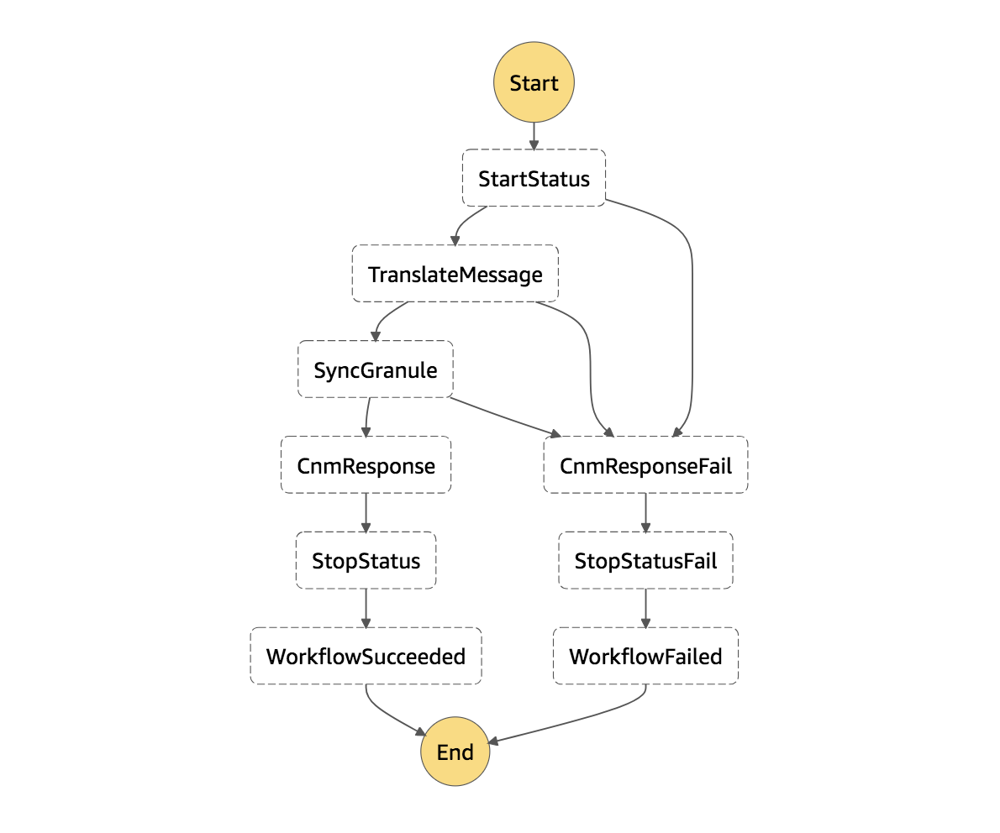

# Error Handling in Workflows

Cumulus Workflow error handling is configurable via Cumulus Workflow Definitions. These workflow definitions are AWS Step Function definitions, and AWS Step Functions enable users to configure what the state machine does next when an exception is thrown. Read more in the AWS docs: [How Step Functions Works: Error Handling](https://docs.aws.amazon.com/step-functions/latest/dg/concepts-error-handling.html).

Cumulus Workflow Tasks _should_ throw errors and rely on the state machine logic to handle the error state. Errors and exceptions thrown in Cumulus Workflow Tasks using the Cumulus Message Adapter (CMA) are caught and rethrown by the CMA libraries _unless_ the error name contains `WorkflowError`.

The former (errors which are not `WorkflowError`s) is the expected behavior. However a `WorklowError` can be used to handle errors that should _not_ result in task failure.

## Workflow Configuration

Some best practices for error handling in Cumulus Workflows are:

* Include the `sf2snsEndLambdaFunction` as a final state (aka the `StopStatus` state). This broadcasts workflow results to an SNS topic.
* Every state should include a `Catch` configuration object which defines the `ResultPath` to be `$.exception`. This passes along the entire Cumulus Message to the next state with the addition of the `Error` and `Cause` details of the thrown error in the `exception` key.
* NOTE: If a task throws an error which is caught by the workflow configuration and passed to another state which also uses the CMA, the CMA overrides the exception key to `"None"` so the exception will not be passed to downstream tasks after the next state. This is okay if the exception is not needed in downstream tasks. However, `sf2snsEndLambdaFunction` does need this exception to understand the failure state, so the error should be re-thrown in any states between the original failed task and `sf2snsEndLambdaFunction`. In the example below, `CnmResponseFail` re-throws any errors passed by upstream tasks.
* If multiple downstreams tasks should run after a workflow task has thrown an error, for example sending a failure to a kinesis stream in addition to running the `sf2snsEndLambdaFunction`, this can handled by creating a second "failure" branch of the workflow. Example:

```
KinesisTriggerTest:
  Comment: 'Tests Workflow from Kinesis Stream'
  StartAt: StartStatus
  States:
    StartStatus:
      Type: Task
      Resource: ${SfSnsReportLambdaFunction.Arn}
      Catch:
        - &ErrorEqualDefaults
          ErrorEquals:
          - States.ALL
          ResultPath: '$.exception'
          Next: CnmResponseFail
      Next: TranslateMessage
    TranslateMessage:
      Type: Task
      Resource: ${CNMToCMALambdaFunction.Arn}
      Catch:
        - <<: *ErrorEqualDefaults
      Next: SyncGranule
    SyncGranule:
      Type: Task
      Resource: ${SyncGranuleLambdaFunction.Arn}
      Catch:
        - <<: *ErrorEqualDefaults
      Next: CnmResponse
    CnmResponse: &CnmResponseDefaults
      Type: Task
      Resource: ${CnmResponseLambdaFunction.Arn}
      Catch:
        - <<: *ErrorEqualDefaults
          Next: StopStatus
      Next: StopStatus
    CnmResponseFail:
      <<: *CnmResponseDefaults  
      Catch:
        - <<: *ErrorEqualDefaults
          Next: StopStatusFail          
      Next: StopStatusFail     
    StopStatus: &StopStatusDefaults
      Type: Task
      Resource: ${sf2snsEndLambdaFunction.Arn}
      Next: WorkflowSucceeded
    StopStatusFail:
      <<: *StopStatusDefaults
      Catch:
        - ErrorEquals:
          - States.ALL
          Next: WorkflowFailed
      Next: WorkflowFailed
    WorkflowSucceeded:
      Type: Succeed
    WorkflowFailed:
      Type: Fail
      Cause: 'Workflow failed'
```

This results in a workflow which is visualized in the diagram below:



## Summary

Error handling should be the domain of workflow configuration.
