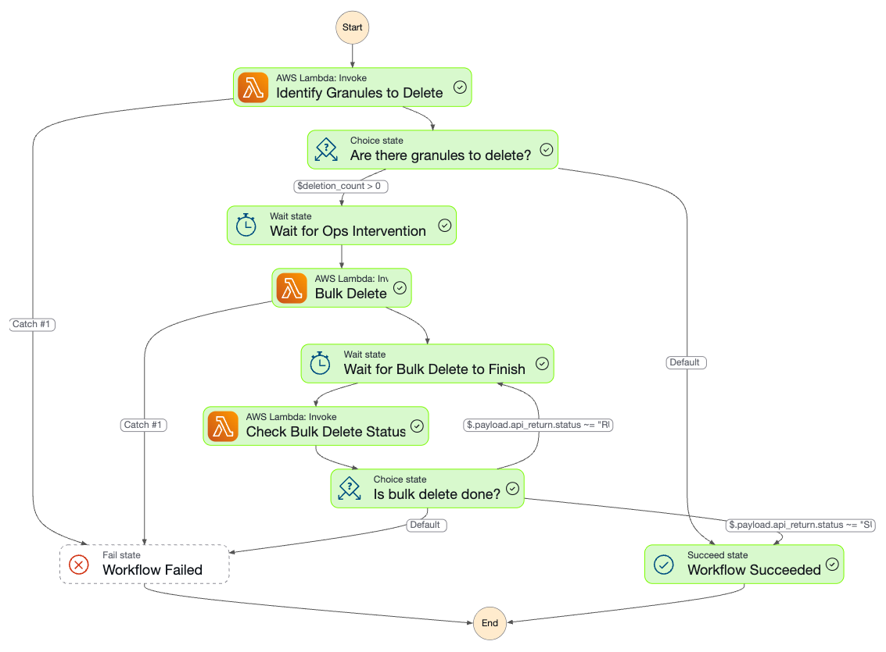

A workflow that uses the granule-invalidator task to identify and remove granules that fit specified criteria.

### Workflow Configuration

```json
{
  "StartAt": "Identify Granules to Delete",
  "States": {
    "Identify Granules to Delete": {
      "Type": "Task",
      "Resource": "${granule_invalidator_arn}",
      "Next": "Are there granules to delete?",
      "Parameters": {
        "cma": {
          "event.$": "$",
          "task_config": {
            "granule_invalidations": "{$.meta.collection.meta.granule_invalidations}",
            "collection": "{$.meta.collection.name}",
            "version": "{$.meta.collection.version}",
            "cumulus_message": {
              "outputs": [
                {
                  "source": "{$.aggregated_stats}",
                  "destination": "{$.meta.aggregated_stats}"
                },
                {
                  "source": "{$.granules_to_be_deleted_count}",
                  "destination": "{$.meta.granules_to_be_deleted_count}"
                },
                {
                  "source": "{$.granules}",
                  "destination": "{$.payload.granules}"
                },
                {
                  "source": "{$.forceRemoveFromCmr}",
                  "destination": "{$.payload.forceRemoveFromCmr}"
                }
              ]
            }
          }
        }
      },
      "Catch": [
        {
          "ErrorEquals": [
            "States.ALL"
          ],
          "Next": "Workflow Failed",
          "ResultPath": "$.error"
        }
      ],
      "Assign": {
        "deletion_count.$": "$.meta.granules_to_be_deleted_count"
      }
    },
    "Are there granules to delete?": {
      "Type": "Choice",
      "Choices": [
        {
          "Variable": "$deletion_count",
          "NumericGreaterThan": 0,
          "Next": "Wait for Ops Intervention"
        }
      ],
      "Default": "Workflow Succeeded"
    },
    "Wait for Ops Intervention": {
      "Type": "Wait",
      "Seconds": 1,
      "Next": "Bulk Delete"
    },
    "Bulk Delete": {
      "Type": "Task",
      "Resource": "${cumulus_internal_api_arn}",
      "Next": "Wait for Bulk Delete to Finish",
      "Parameters": {
        "httpMethod": "POST",
        "resource": "{proxy+}",
        "path": "/granules/bulkDelete",
        "headers": {
          "Content-Type": "application/json"
        },
        "body.$": "States.JsonToString($.payload)"
      },
      "Catch": [
        {
          "ErrorEquals": [
            "States.ALL"
          ],
          "Next": "Workflow Failed",
          "ResultPath": "$.error"
        }
      ],
      "ResultSelector": {
        "api_return.$": "States.StringToJson($.body)"
      },
      "ResultPath": "$.payload"
    },
    "Check Bulk Delete Status": {
      "Type": "Task",
      "Resource": "${cumulus_internal_api_arn}",
      "Parameters": {
        "httpMethod": "GET",
        "resource": "{proxy+}",
        "path.$": "States.Format('/asyncOperations/{}', $.payload.api_return.id)",
        "headers": {
          "Content-Type": "application/json"
        }
      },
      "ResultSelector": {
        "api_return.$": "States.StringToJson($.body)"
      },
      "ResultPath": "$.payload",
      "Next": "Is bulk delete done?"
    },
    "Is bulk delete done?": {
      "Type": "Choice",
      "Choices": [
        {
          "Variable": "$.payload.api_return.status",
          "StringMatches": "RUNNING",
          "Next": "Wait for Bulk Delete to Finish"
        },
        {
          "Variable": "$.payload.api_return.status",
          "StringMatches": "SUCCEEDED",
          "Next": "Workflow Succeeded"
        }
      ],
      "Default": "Workflow Failed"
    },
    "Wait for Bulk Delete to Finish": {
      "Type": "Wait",
      "Seconds": 10,
      "Next": "Check Bulk Delete Status"
    },
    "Workflow Failed": {
      "Type": "Fail"
    },
    "Workflow Succeeded": {
      "Type": "Succeed"
    }
  }
}
```

Workflow **error-handling** can be configured as discussed in the [Error-Handling](error-handling.md) cookbook.  This workflow is configured to identify granules to delete in one step, then interact with the Cumulus Private API lambda to run a bulk deletion of those granules in a separate step.

### Task Configuration

The granule-invalidator task is provided for you as part of the `cumulus` terraform module, no specific configuration is needed.  In order to provide the critera that defines the behavior of this rolloff functionality, one of three patterns can be configured;

- science_date; Identify granules that are older than a specified number of minutes based on their stored ProductionDateTime.
- ingest_date; Identify granules that are older than a specified number of minutes based on their CreatedAt time (eg when they were initially ingested into Cumulus).
- cross_collection; Identify granules that have a begin and end datetime that match exactly those of another specified collection.

Example: The following sample configuration lists all AMSR_E_L2_Rain v13 granules older than 525600 minutes and all granules that have a corresponding granule in the AMSR_E_L2_Ocean v13 collection that match beginning and end time:

```json
{
  "collection": "AMSR_E_L2_Rain",
  "version": "13",
  "granule_invalidations": [
    {
      "type": "science_date",
      "maximum_minutes_old": 525600
    },
    {
      "type": "cross_collection",
      "invalidating_collection": "AMSR_E_L2_Ocean",
      "invalidating_version": "13"
    }
  ]
}
```

Specific details of the configuration schema for this task can be found at ['cumulus/tasks/granule-invalidator/src/schemas'](https://github.com/nasa/cumulus/tasks/granule-invalidator/src/schemas/).  In the workflow above, this configuration is passed in via the collection config (see `"granule_invalidations": "{$.meta.collection.meta.granule_invalidations}"`).

If you want to manually deploy your own version of this Lambda for testing, you can copy the Lambda resource definition located in the Cumulus source code at [`cumulus/tasks/granule-invalidator/deploy`](https://github.com/nasa/cumulus/tasks/granule-invalidator/deploy). The Lambda source code is located in the Cumulus source code at ['cumulus/tasks/granule-invalidator/src'](https://github.com/nasa/cumulus/tasks/granule-invalidator/src/).

## Execution

We will focus on using the Cumulus dashboard to schedule the execution of a rolloff workflow.

Our goal here is to create a rule through the Cumulus dashboard that will define the scheduling and execution of our rolloff workflow, specified to run periodically against a single collection. Let's navigate to the `Rules` page and click `Add a rule`.

```json
{
  "collection": {                  # collection values can be configured and found on the Collections page
    "name": "${collection_name}",
    "version": "${collection_version}"
  },
  "name": "rolloff_rule",
  "provider": "${provider}",       # found on the Providers page
  "rule": {
    "type": "onetime"
  },
  "state": "ENABLED",
  "workflow": "RolloffGranules" # This can be found on the Workflows page
}
```


_Executed workflow as seen in AWS Console_

### Output/Results

The `Executions` page presents a list of all executions, their status (running, failed, or completed), to which workflow the execution belongs, along with other information. The rule defined in the previous section should start an execution of its own accord, and the status of that execution can be tracked here.

To get some deeper information on the execution, click on the value in the `Name` column of your execution of interest. This should bring up a visual representation of the workflow similar to that shown above, execution details, and a list of events.

## Summary

We set up a workflow above that identifies and deletes granules associated with a collection on a schedule based on specific defined criteria.

It's important to note that the workflow definition above is a very simple demonstration of how this rolloff functionality works, and an operator may want additional monitoring to assure appropriate deletion of granules.  This can be accomplished by adding `SNS` workflow steps that trigger emails to operators and modifying the `wait` step to allow additional time for operators to intervene if needed.
