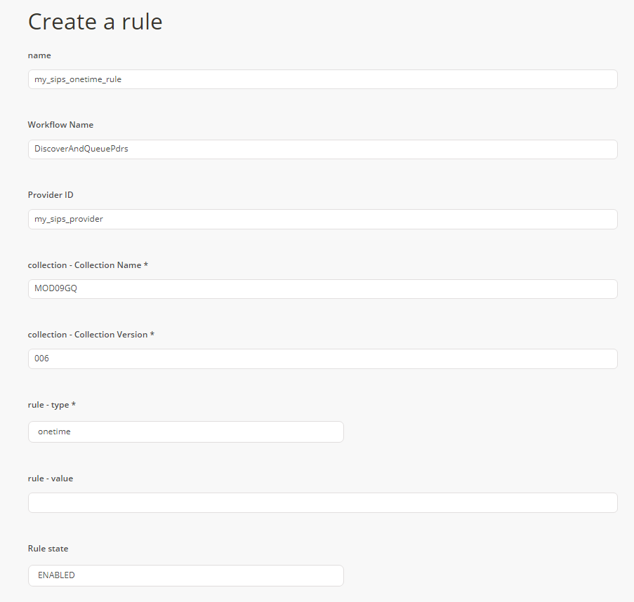
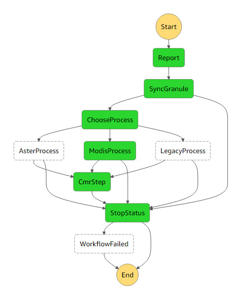

# Science Investigator-led Processing Systems (SIPS)
The Cumulus ingest workflow supports the SIPS workflow. In the following document, we'll discuss what a SIPS workflow is and how to set one up in a Cumulus instance.

In this document, we assume the user already has a provider endpoint configured and ready with some data to ingest. We'll be using an S3 provider and ingesting from a MOD09GQ collection.

## Setup

1. We need to build a collection. Details on collections can be found [here](data-cookbooks/setup.md#collections). The following collection will have `MOD09GQ` as a collection name, `006` as a version, and is configured to pull pdrs from `${bucket}/cumulus-test-data/pdrs` in S3 (where `${bucket}` is configured in the provider).
```
{
    "queriedAt": "2018-08-03T16:44:25.919Z",
    "name": "MOD09GQ",
    "version": "006",
    "process": "modis",
    "sampleFileName": "MOD09GQ.A2017025.h21v00.006.2017034065104.hdf",
    "dataType": "MOD09GQ",
    "granuleIdExtraction": "(MOD09GQ\\..*)(\\.hdf|\\.cmr|_ndvi\\.jpg)",
    "createdAt": 1531324194001,
    "granuleId": "^MOD09GQ\\.A[\\d]{7}\\.[\\S]{6}\\.006\\.[\\d]{13}$",
    "provider_path": "cumulus-test-data/pdrs",
    "files": [
  	    {
  	        "bucket": "protected",
  	        "regex": "^MOD09GQ\\.A[\\d]{7}\\.[\\S]{6}\\.006\\.[\\d]{13}\\.hdf$",
  	        "sampleFileName": "MOD09GQ.A2017025.h21v00.006.2017034065104.hdf",
  	        "url_path": "{cmrMetadata.Granule.Collection.ShortName}/{extractYear(cmrMetadata.Granule.Temporal.RangeDateTime.BeginningDateTime)}/{substring(file.name, 0, 3)}"
  	    },
  	    {
  	        "bucket": "private",
  	        "regex": "^MOD09GQ\\.A[\\d]{7}\\.[\\S]{6}\\.006\\.[\\d]{13}\\.hdf\\.met$",
  	        "sampleFileName": "MOD09GQ.A2017025.h21v00.006.2017034065104.hdf.met"
  	    },
  	    {
  	        "bucket": "protected-2",
  	        "regex": "^MOD09GQ\\.A[\\d]{7}\\.[\\S]{6}\\.006\\.[\\d]{13}\\.cmr\\.xml$",
  	        "sampleFileName": "MOD09GQ.A2017025.h21v00.006.2017034065104.cmr.xml"
  	    },
  	    {
  	        "bucket": "public",
  	        "regex": "^MOD09GQ\\.A[\\d]{7}\\.[\\S]{6}\\.006\\.[\\d]{13}_ndvi\\.jpg$",
  	        "sampleFileName": "MOD09GQ.A2017025.h21v00.006.2017034065104_ndvi.jpg"
  	    }
    ],
    "duplicateHandling": "replace",
    "updatedAt": 1533313794693,
    "url_path": "{cmrMetadata.Granule.Collection.ShortName}/{substring(file.name, 0, 3)}",
    "timestamp": 1533313798525,
    "stats": {
        "running": 0,
        "completed": 0,
        "failed": 2,
        "total": 2
    }
}
```

2. We need to have a [provider](data-cookbooks/setup.md#providers) from whom data can be ingested. Our provider is an S3 provider hosted in the `cumulus-test-internal` bucket.


3. Finally, let's create a [rule](data-cookbooks/setup.md#rules). In this example we're just going to create a `onetime` throw-away rule that will be easy to test with. This rule will kick off the `DiscoverAndParsePdrs` workflow, which is the beginning of a Cumulus SIPS workflow.




**Note:** A list of configured workflows exists under the "Workflows" in the navigation bar on the Cumulus dashboard. Additionally, one can find a list of executions and their respective status in the "Executions" tab in the navigation bar.

## DiscoverAndQueuePdrs Workflow

This workflow will (as the name might suggest) discover pdrs and queue them to be processed. Duplicate pdrs will be dealt with according to the configured duplicate handling setting.

1. DiscoverPdrs
2. QueuePdrs


## ParsePdr Workflow

The ParsePdr workflow will parse a pdr, queue the specified granules (duplicates are handled according to the duplicate handling setting) and periodically check the status of those queued granules. This workflow will not succeed until all the granules included in the pdr are successfully ingested. If one of those fails, the ParsePdr worklfow will fail.

1. ParsePdr
2. QueueGranules
3. CheckStatus


## IngestGranule Workflow

1. SyncGranule
2. ProcessingStep
3. CmrStep



