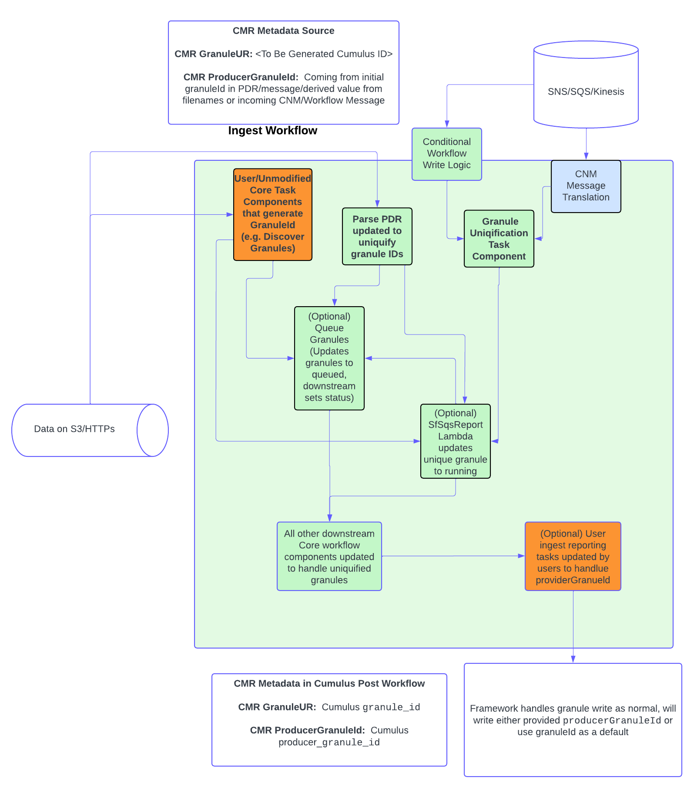
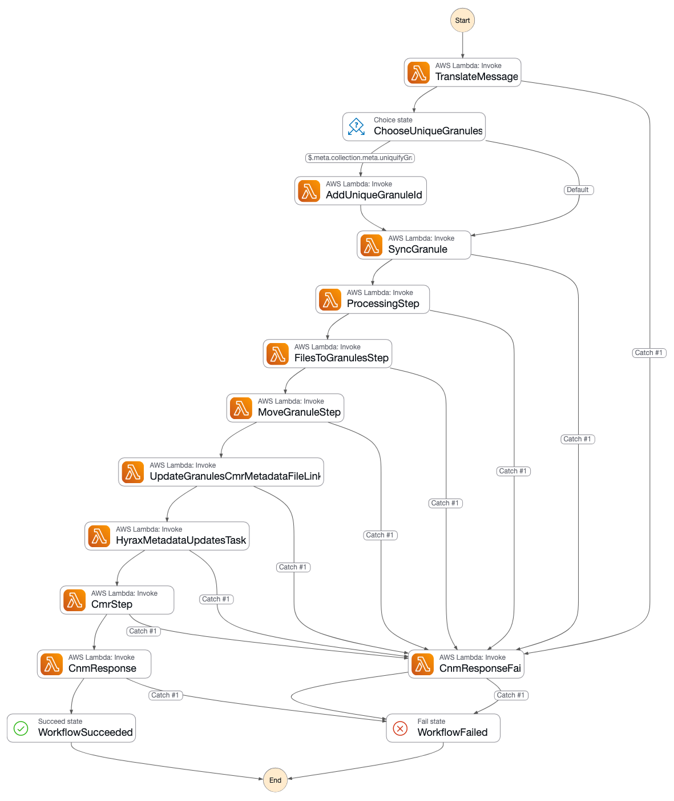

## **Overview**

The Granule Uniquification feature in Cumulus allows for the ingestion and management of multiple granules that share the same `granuleId` but belong to different collections. This is achieved by creating a unique `granuleId` for each granule and storing the original, non-unique identifier in a new field called `producerGranuleId`.

This feature is critical for systems migrating from ECS and other workflows where `granuleId` may not be globally unique.    Existing workflows that have no need for this feature should be compatible with no changes, however the end result will be the `granuleId` and `producerGranuleId` will be set to the same value if producerGranuleId is not specified.

This feature was added in Cumulus version 21, this document provides an overview of the feature and high level changes associated with the feature from previous versions.

## Technical Approach

The changes included with this feature make updates to the Cumulus database schema, granule read/write/reporting components and workflow task components.

The intent is to modify the Cumulus database and framework to handle tracking both a unique identifier `granuleId` and provide a granule object field `producerGranuleId` that tracks an identifier from the data producer/provider that *may not* be unique.

In concert with those updates, Cumulus task components that generate granule objects have been updated to optionally be configured to 'uniquify' granule objects by generating a unique `granuleId` and storing the original `granuleId` value in the `producerGranuleId` field.

### *Adding 'uniquification' to Ingest Workflows*

The process of updating or creating an ingest workflow that makes use of this feature should follow the following high-level guidelines:

* If providers/pre-ingest processing provides `producerGranuleId` as part of the granule object and pre-uniquifies the graunleId, Core task components will 'do the right thing' out of the box.
* Ingest workflows that have incoming granules that have only granuleId populated will need to make use of the updated Cumulus workflow task components *or* make updates to other in-use functions to make the granuleId unique  as appropriate.  For details on this, please see the following:

  * [hashing approach document](doc:granule-id-hashing-approach) for details on the approach Cumulus components that create a `granuleId` are using.  Please also review the added task component

  * [`AddUniqueGranuleId`](https://github.com/nasa/cumulus/blob/master/tasks/add-unique-granule-id/README.md) that can be utilized in workflows to update a granule with a unique `granuleId`, saving the 'original' as `producerGranuleId`.

  * [Updated Workflow Task Component Modifications](#updated-workflow-task-component-modifications)

* Workflows that *start* with a Cumulus message (*not* a CNM message or other format) with a payload containing granules but intend to change the ID as part of the workflow will need to reconfigure Cumulus to not report the initial granules prior to workflow steps that update the granule to have a unique Id and *optionally* update the workflow to report them as running following that uniquification using `SfSqsReportTask`.  See [relevant doc](link goes here) for more information.

***Important***: User task components, particularly any that re-implement core reference tasks, must be evaluated carefully to ensure consistent behavior in instances where the `granuleId` has been modified.

The following diagram shows expected flow and potential modification considerations for a typical ingest flow, with orange being components that may need modification/update to make use of this feature, and green representing updated Core task components:

---



---

### **Uniquification Methodology**

Optimally, adding a `uniqueGranuleId` and populating a relevant `producerGranuleId` in incoming granules should be done prior to ingest into Cumulus.  Cumulus maintained workflow tasks have been updated to handle incoming messages with `producerGranuleId` and `granuleId` appropriately.

If that's not possible due to filename based discovery ingest, or provider process restrictions, the updated task components allow an in-workflow approach to making granuleIds unique.

When a workflow is configured to utilize any of the modified tasks that generate a unique ID, Cumulus workflow tasks use a hashing algorithm to generate a unique suffix that is appended to the original `granuleId`. This process is handled by the `add-unique-granule-id` task, is integrated into some tasks (e.g. `parse_pdr`), or relevant user tasks can be updated  as well.

The recommended algorithm generates an MD5 hash of the granule's `collectionId` (and optionally a timestamp) and appends a truncated version of this hash to the `producerGranuleId` to create the new unique `granuleId`.

The process Cumulus Core uses to generate a unique `granuleId` can be found in the [`generateUniqueGranuleId` function](https://github.com/nasa/cumulus/blob/master/packages/ingest/src/granule.ts).

For more details on the algorithm and for implementations in other languages, see the [Hashing approach document](doc:granule-id-hashing-approach)

There is no requirement to utilize Core's algorithm, as the workflow framework imposes no constraints outside of ensuring `producerGranuleId` is populated by a default, *however* if customization is desired, care should be taken to ensure that unique identification schemes are chosen such that unexpected collisions between granules do not occur system-wide.

To make the process easier, Cumulus Core also provides a Task Component that will uniquely identify each Granule in a payload and return a modified Granule object containing a unique `granuleId` and a `producerGranuleId` containing the original `granuleId` - [`AddUniqueGranuleId`](https://github.com/nasa/cumulus/blob/master/tasks/add-unique-granule-id/README.md)

---

### External Impacts

Deploying a version of Cumulus with this feature enabled will result in the following impacts to downstream ecosystem as of when this document was last updated:

* CMR - Exported CMR metadata will now have UMMG/XML appropriate metadata populating the `ProducerGranuleId` in workflows that make use of the `Update Granules CMR Metadata File Links` task.   For more information/specifics see the [task README](https://github.com/nasa/cumulus/blob/master/tasks/update-granules-cmr-metadata-file-links/README.md)
* Metrics - Granule objects newly ingested/updated will have the `producerGranuleId` field populated
* Lzards - Granules ingested using the updated task component will now have `producerGranuleId` field populated as part of the LZARDS metadata.
* Orca - no impacts, pending Orca updates that make use of the new field

## Migration From Prior Versions

Users migrating to the release using this feature will need to migrate their database to make use of and populate the new `producer_granule_id` field in the Postgres database.  Details of this transition are documented in the [upgrade notes document](doc:update-granules-to-include-producer_granule_id).

### Existing Workflow Updates

For existing ingest workflows/processes not wishing to update, the only functional changes are:

* The framework (post workflow event driven writes) populating a granule's `producerGranuleId` granule field with the value from the `granuleId` field if one is not provided as part of the ingest workflow.
* [`UpdateGranulesCmrMetadataFileLinks`](https://github.com/nasa/cumulus/blob/master/tasks/update-granules-cmr-metadata-file-links/README.md) will update the CMR metadata to include the new `producerGranuleId` in the CMR metadata.

---

## Core Changes

The following sections detail changes to Cumulus Core as part of this feature:

### Schema Changes

* **`granuleId`**: This field remains unchanged in the Core schema, and remains a unique identifier for a granule within the Cumulus system. For granules that originally had a different `granuleId` via Cumulus Core Task Components or a provider provided identifier, this value will be a combination of the original `granuleId` and a configurable hash.

Downstream consumers of Cumulus granule objects should not need to make modifications related to this field.   Core will be moving away from API and other concepts that relate to identifying granule objects by `granuleId` + `collectionId` in future versions.

* **`producerGranuleId`**: This new field is intended to store the original, non-unique producer granule identification value.    This allows for traceability and correlation with the provider's source data.

If using Cumulus Core reference Task Components this value will be retained from the original `granuleId`.    If using another process, or the provider is providing uniquified IDs, it's expected that `producerGranuleId` will be populated with an appropriate value.

Downstream consumers of Cumulus granules objects should update to make use of this field if they intend to directly reference `producerGranuleId` or need to reconcile their records to provider records directly.

### Updated [`MoveGranules`](https://github.com/nasa/cumulus/blob/master/tasks/move-granules/README.md) 'duplicate' handling behavior

Move Granules was [updated](https://github.com/nasa/cumulus/pull/4003) to validate if an archive location object collision is due to a same-collection or cross-collection collision.    If the collision is cross-collection, it will fail *regardless* of the collection configuration, to avoid inadvertent overwrites per requirements in IART-924.

### Updated Workflow Task Component Modifications

The following tasks have been added or updated from prior versions to handle and/or allow conversion to use the new `producerGranuleId` field for this feature.  All Core workflow tasks that utilize a granule payload were updated to allow for producerGranuleId in the granule object schema, and are not individually listed here if that was the only update.

**Please refer to the README and schemas for the tasks as the source of truth regarding configuration options, this information is true at the time of feature implementation**:

#### Added

##### [`AddUniqueGranuleId`](https://github.com/nasa/cumulus/blob/master/tasks/add-unique-granule-id/README.md)

Task was added to provide a 'shim' option to allow for incoming granules without a producerGranuleId to be `uniqified` as part of a workflow. A new ID is created and stored as the unique `granuleId`, with the original ID in the incoming granule retained in the `producerGranuleId` field.   For details on the hashing approach used in this function see: [hashing approach document](doc:granule-id-hashing-approach)

#### Updated

##### [`LzardsBackup`](https://github.com/nasa/cumulus/blob/master/tasks/LZARDS-backup/README.md)

* Task was updated to include `producerGranuleId` as part of the LZARDS `metadata` object

##### [`ParsePdr`](https://github.com/nasa/cumulus/blob/master/tasks/parse-pdr/README.md)

* Task was updated to take an optional configuration parameter `uniquifyGranules` that if set to `true` will update the granuleId for all found granules to have a unique granule hash appended to the existing ID   ([PR #3968](https://github.com/nasa/cumulus/pull/3983)).
* Task was updated to always populate producerGranuleId for the output granule with the incoming producerGranuleId.
* Task was updated to detect duplicate granuleIds and throw an error if uniquification is not enabled.

##### [`QueueGranules`](https://github.com/nasa/cumulus/blob/master/tasks/queue-granules/README.md)

* Task was updated to set `producerGranuleId` to `granuleId` if not set in the input granules ([PR #3968](https://github.com/nasa/cumulus/pull/3968))

##### [`UpdateGranulesCmrMetadataFileLinks`](https://github.com/nasa/cumulus/blob/master/tasks/update-granules-cmr-metadata-file-links/README.md)

* Task was updated to always set `granuleUR` and `producerGranuleId` in the CMR metadata file based on the passed in granule. ([PR #3997](https://github.com/nasa/cumulus/pull/3997))

##### [`FilesToGranules`](https://github.com/nasa/cumulus/blob/master/tasks/update-granules-cmr-metadata-file-links/README.md)

* Task was updated to allow `producerGranuleId` in the granule schema, and added `matchFilesWithProducerGranuleId` as a configuration flag

### Updated Cumulus Framework Behaviors

* The API will now allow for updates/writing of `producerGranuleId`.    This field is set either to the incoming value in the granule object *or* defaults to the value for `granuleId`.
* Granule PUT, GET, PATCH and POST will allow for `producerGranuleId` to be set.
* `producerGranuleId` will be output from all calls that output a granule object, and update SNS topics will report them to downstream consumers as well

## Workflow Feature Use

### Collection Configuration

Most of the task Granule uniquification options in the updated task components can be enabled and configured at the collection level using `meta` , or optionally be provided via workflow configuration or a rule `meta` field.

As an example, collection oriented configuration can be achieved in the [`AddUniqueGranuleId`](https://github.com/nasa/cumulus/blob/master/tasks/add-unique-granule-id/README.md) implementations by adding the following to the `collection.meta` object:

```json
"meta": {
  "uniquifyGranuleId": true,
  "hashLength": 8
}

```

Once you've done that, you can then add task configuration hooks to the workflow components that need configuration:

```json
     "AddUniqueGranuleId": {
      "Parameters": {
        "cma": {
          "event.$": "$",
          "ReplaceConfig": {
            "Path": "$.payload",
            "TargetPath": "$.payload"
          },
          "task_config": {
            "hashLength": "{$.meta.collection.meta.hashLength}"
          }
        }
      },
```

If `uniquifyGranuleId` is `true` and the Collection is ingested using a workflow that includes the `AddUniqueGranuleId` Task (required to update the granuleId), the `granuleId` will be uniquely generated using the [`generateUniqueGranuleId` function here](https://github.com/nasa/cumulus/blob/master/packages/ingest/src/granule.ts). The `hashLength` specifies how many characters the randomized hash contains. More characters offer a greater chance of uniqueness.

[Here is an example workflow configuration including the AddUniqueGranuleId task.](https://github.com/nasa/cumulus/blob/master/example/cumulus-tf/cnm_workflow.asl.json)

#### Collection Path Considerations

:::caution
A Collection that is configured to uniquely identify Granules in this way means that the existing `granuleId` will change to a unique, hashed value. This is important to consider when building workflows and, in particular, specifying the S3 paths for a Granule's Files. ***This is also true for all workflows that may be run with Granules that have previously had their `granuleId` uniquely generated***

In a Collection configuration, you can specify the `url_path` template that will be used to determine the final location of the Collection's Files if using the  `MoveGranules` Task Component.

If that path contains a `granuleId` or anything derived from `granuleId`, notably the CMR Metadata's `GranuleUR`, that path will contain the unique value. An example containing the unique `granuleId` might look like:

```json
"url_path": "{cmrMetadata.Granule.Collection.ShortName}___{cmrMetadata.Granule.Collection.VersionId}/{granule.granuleId}",
```

or

```json
"url_path": "{cmrMetadata.Granule.Collection.ShortName}___{cmrMetadata.Granule.Collection.VersionId}/{cmrMetadata.Granule.GranuleUR}",
```

If that is NOT desirable and using the original, non-unique value is preferred, that is still possible. The Collection would need to be configured to use the `producerGranuleId`, which represents the original `granuleId` value without any uniquification, or a completely different value.

```json
"url_path": "{cmrMetadata.Granule.Collection.ShortName}___{cmrMetadata.Granule.Collection.VersionId}/{granule.producerGranuleId}/",
```

Taking it a step further, depending on the workflow configuration, users can specify a default using the `defaultTo` operation if the `producerGranuleId` isn't available for a given Granule.

```json
"url_path": "{cmrMetadata.Granule.Collection.ShortName}___{cmrMetadata.Granule.Collection.VersionId}/{defaultTo(granule.producerGranuleId, granule.granuleId)}",
```

:::

### Workflow Example

Cumulus's integration deployment provides an example of a `CNM` style workflow [here](https://github.com/nasa/cumulus/blob/master/example/cumulus-tf/cnm_workflow.asl.json) that can be used for both uniquified and non-uniquified collections.   This workflow is a typical single-workflow ingest using a Kinesis stream that is triggering workflows with a CNM message, but it uses a choice state to configurably use the [`AddUniqueGranuleId`](https://github.com/nasa/cumulus/blob/master/tasks/add-unique-granule-id/README.md) task in the workflow for collections that are configured to handle this in-workflow:



Downstream steps have the relevant configuration values wired in from the collection configuration for steps that require it.  For example the integration test "ProcessingStep":

```json
"task_config": {
            "bucket": "{$.meta.buckets.private.name}",
            "collection": "{$.meta.collection}",
            "cmrMetadataFormat": "{$.meta.cmrMetadataFormat}",
            "additionalUrls": "{$.meta.additionalUrls}",
            "matchFilesWithProducerGranuleId": "{$.meta.collection.meta.uniquifyGranuleId}"
```
