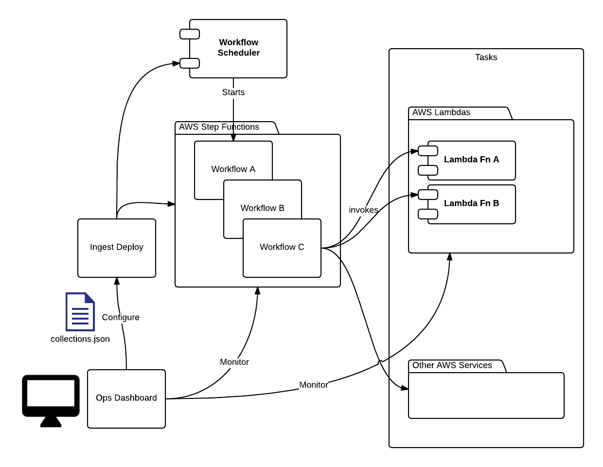

# Ingest Design

## Overview

Provider data ingest and GIBS have a set of common needs in getting data from a source system and into the cloud where they can be distributed to end users. These common needs are:

* **Data Discovery** - Crawling, polling, or detecting changes from a variety of sources.
* **Data Transformation** - Taking data files in their original format and extracting and transforming them into another desired format such as visible browse images.
* **Archival** - Storage of the files in a location that's accessible to end users.

AWS and other cloud vendors provide an ideal solution for parts of these problems but there needs to be a higher level solution to allow composition of AWS components into a full featured solution. Ingest is designed to meet the needs for Earth Science data ingest and transformation.

## Goals

* **Operators should have visibility.**
  * Operators should be able to see and understand everything that is happening in the system.
  * It should be obvious why things are happening and straightforward to diagnose problems
* **Operators Know Best**
  * We generally assume that the operators know best in terms of the limits on a providers infrastructure, how often things need to be done, and details of a collection. The architecture should defer to their decisions and knowledge.
* **Safety Nets**
  * This is the counter point to "Operators Know Best". We will prevent them from shooting them in the foot where possible. But we will also allow them to bypass the safety net when necessary.
* **Maintain Provenance of Data**
  * We should have traceability for how data was produced and where it comes from.
  * Use immutable representations of data. Data once received is not overwritten. Data can be removed for cleanup.
  * All software is versioned. We can trace transformation of data by tracking the immutable source data and the versioned software applied to it.
* **Simplicity**
  * **Prefer straightforward approaches to magic.**
    * "Magic" is often used derisively when describing technologies that make things happen in a way that is not plainly clear.
    * Good Example: Enabling reuse of configuration through the yaml files. This is a well known feature of yaml. Previously we used a JSON file that automatically inherited data and merged configuration. This isn't too much magic but it is not as clear as the yaml configuration.
* **Flexibility and Composability**
  * The steps to ingest and process data is different from collection to collection within a provider.
  * Ingest should be as flexible as possible in the rearranging of steps and configuration.
  * We want to use lego-like individual steps that can be composed by an operator.
  * Individual steps should ...
    * be as ignorant as possible of the overall flow. They should not be aware of previous steps.
    * be runnable on their own.
    * define themselves input and output in pure JSON data structures.
    * be domain agnostic
      * Don't make assumptions of specifics of what goes into a granule for example.

## The Architecture

Ingest components can be divided into two categories, AWS Runtime and Configuration. The AWS Runtime components orchestrate the execution of different tasks to perform discovery, transformation, and persistence of data. The Configuration components allow an operator to compose the different runtime components and set them up in AWS.



**TODO remove Ops dashboard**

**TODO an example configured workflow**

* [**Collection Configuration File**](#collection-configuration-file)
* [**Ingest Deploy**](#ingest-deploy)
* [**Workflow Scheduler**](#workflow-scheduler)
* [**Workflows**](#workflows)
* [**Tasks**](#tasks)

### Collection Configuration File

**TODO Update this based on recent changes**

The workflows, schedule, tasks, and configuration for a collection is configured via a JSON file. Generated HTML documentation from the JSON Schema is included below.

Notes about the Schema

* **Leverages Existing Work**
  * The design leverages the existing work of Amazon by defining workflows using the [AWS Step Function State Language](http://docs.aws.amazon.com/step-functions/latest/dg/amazon-states-language.html#amazon-states-language). This is the language that was created for describing the state machines used in AWS Step Functions.
* **Open for Extension**
  * Both `meta` and `task_config` which are used for configuring at the collection and task levels do not dictate the fields and structure of the configuration. Additional task specific JSON schemas can be used for extending the validation of individual steps.  
* **Data-centric Configuration**
  * The use of a single JSON configuration file allows this to be added to a workflow. We build additional support on top of the configuration file for simpler domain specific configuration or interactive GUIs.

#### Collection Configuration JSON Schema

[collections_config_schema.json](/schemas/collections_config_schema.json)

[Example Collection Config](/schemas/example-data/example-collection.json)

<script src="docson/widget.js" data-schema="/schemas/collections_config_schema.json">
</script>

#### URL Templating

When each task executes, it is expected to resolve URL templates found in its collection configuration against the entire collection configuration. For example, tasks should resolve the following collection:

```JSON
{
  "meta": { "name": "Hello" },
  "config" : { "output" : "{meta.name} World!" }
}
```

Into this:

```JSON
{
  "meta": { "name": "Hello" },
  "config" : { "output" : "Hello World!" }
}
```

URL template variables replace dotted paths inside curly brackets with their corresponding value. If a Task cannot resolve a value, it should ignore the template, leaving it verbatim in the string.  This allows decoupling tasks from one another and the data that drives them. Tasks are able to easily receive runtime configuration produced by previously run Tasks and domain data.

### Ingest Deploy

**TODO document ingest deployment**

### Workflow Scheduler

The scheduler is responsible for initiating the start of a step function and passing in the relevant data for a collection. This is currently configured as an interval for each collection. The Scheduler service creates the initial event by combining the collection configuration with the AWS execution context provided by its CloudFormation template.

**TODO diagram of how task message is built from collection configuration**

### Workflows

A workflow is a provider configured set of steps that describe the process to ingest data. Workflows are defined using [AWS Step Functions](https://aws.amazon.com/documentation/step-functions/).

#### Benefits of AWS Step Functions

AWS Step functions are described in detail in the AWS documentation but they provide several benefits which are applicable to AWS.

* Prebuilt solution
* Operations Visibility
  * Visual diagram
  * Every execution is recorded with both inputs and output for every step.
* Composability
  * Allow composing AWS Lambdas and code running in other steps. Code can be run in EC2 to interface with it or even on premise if desired.
  * Step functions allow specifying when steps run in parallel or choices between steps based on data from the previous step.
* Flexibility
  * Step functions are designed to be easy to build new applications and reconfigure. We're exposing that flexibility directly to the provider.
* Reliability and Error Handling
  * Step functions allow configuration of retries and adding handling of error conditions.
* Described via data
  * This makes it easy to save the step function in configuration management solutions.
  * We can build simple interfaces on top of the flexibility provided here if

### Tasks

A workflow is composed of tasks. Each task is responsible for performing a discrete step of the ingest process. These can be activities like:

* Crawling a provider website for new data.
* Uploading data from a provider to S3.
* Executing a process to transform data.

AWS Step Functions permit [tasks](http://docs.aws.amazon.com/step-functions/latest/dg/concepts-tasks.html#concepts-tasks) to be code running anywhere, even on premise. We expect most tasks will be written as Lambda functions in order to take advantage of the easy deployment, scalability, and cost benefits provided by AWS Lambda.

#### Task Input and Output Messages

Ingest uses a common format for all inputs and outputs from Tasks consisting of a JSON object which holds all necessary information about the task execution and AWS environment. Ingest defines a schema for the input and output messages using the [Envelope JSON schema](/schemas/envelope_schema.json). See the embedded HTML documentation generated from the schema below. Tasks return objects identical in format to their input with the exception of a task-specific `"payload"` field. Tasks may also augment their execution metadata.

[envelope_schema.json](/schemas/envelope_schema.json)

[Example Message Envelope](/schemas/example-data/example-message-envelope.json)

<script src="docson/widget.js" data-schema="/schemas/envelope_schema.json">
</script>

#### Common Tasks and Library

**TODO document the common tasks and library**


## Benefits

**TODO document benefits**

* Flexibility

Possible benefits

* Data centric representation for configuration
  * Allows incorporation into existing flows or mapping existing configuration formats (recipes.json) to the new format.
* Leverage the advantages of AWS
  * Leverage scalability of things like Serverless architectures.
  * Take advantage of existing AWS solutions that remove the need for building our own solutions.
* Minimize price
* Reusing lessons from prototype
  * TODO what are these
* Reusing lessons from past systems like CMR
*

## Tradeoffs

**TODO document additional tradeoffs**

* We specify the statemachine using the same format as AWS Step Functions.
  * Downsides
    * Tight coupling with their format.
    * If they make changes in the future we will have to deal with existing projects written against that.
  * Benefits
    * We can support anything AWS supports without
* Collections Configuration File is very flexible but requires more knowledge of AWS step functions etc to configure.
  * Mitigation is that we can map recipes or other simpler configuration files into this one.
  * We gain the flexibility of this while also allows configuration through a simpler file. We still have to write an maintain the code to perform the translation.


## Open Questions

* How does each step know which configuration element to use?
 * The configuration for an individual step is located in the config that is passed in the message. The step needs to know which step it is so it can retrieve it from the full config. The problem is unless it is hard coded in the step it does not know what it's name is. This makes it difficult to reuse a step in multiple locations.
* How do we version the state machines?