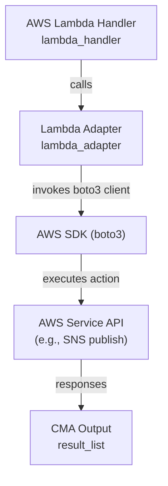

# @cumulus/aws-api-proxy-task

This task provides a Cumulus Message Adapter (CMA) wrapped proxy that invokes a
pre-approved AWS API action via boto3. It is intended for use within a Cumulus
workflow and enforces guardrails through schema validation and IAM permissions.
Currently, the schema allows the SNS `publish` action, with support for multiple
invocations in a single task execution via `iterate_by`.

## Usage

This lambda takes the following input and config objects, derived from workflow
configuration using the
[Cumulus Message Adapter](https://github.com/nasa/cumulus-message-adapter/blob/master/CONTRACT.md).
The output from the task follows the CMA contract and provides the information
detailed below.

### Configuration

| field name | type | default | required | values | description
| ---------- | ---- | ------- | -------- | ------ | -----------
| service | string | N/A | yes | `sns` | AWS service to invoke
| action | string | N/A | yes | `publish` | Service action to invoke
| parameters | object | N/A | yes | N/A | Parameters passed to the AWS SDK action
| parameters.TopicArn | string | N/A | yes | N/A | SNS Topic ARN to publish to
| parameters.Message | string | N/A | yes | N/A | Message string to publish
| iterate_by | string | N/A | no | N/A | Name of a `parameters` field containing a list; each value produces a separate call
| parameter_filters | array | [] | no | N/A | List of transformations to apply to parameter fields before invoking the API
| parameter_filters[].name | string | N/A | yes | `json.dumps` | Filter to apply
| parameter_filters[].field | string | N/A | yes | N/A | Parameter field name to transform

The following sample configuration publishes two messages to two topics by
iterating over a list of ARNs:

```json
{
	"service": "sns",
	"action": "publish",
	"iterate_by": "TopicArn",
	"parameters": {
		"TopicArn": [
			"arn:aws:sns:us-east-1:123456789012:ExampleTopicA",
			"arn:aws:sns:us-east-1:123456789012:ExampleTopicB"
		],
		"Message": "Message for topic"
	}
}
```

When `iterate_by` is set, the named field in `parameters` must be a list. The
task will create one API call per list entry by substituting each value into the
specified field. If `parameter_filters` are provided, each filter is applied to
the named field across all generated parameter sets. The only supported filter
is `json.dumps`, which serializes the field value as JSON.

### Input

The input payload for this task is expected to be empty. All invocation details
are passed via the task configuration.

### Output

The task returns a list of boto3 responses (one per entry generated by
`iterate_by`).
Each response includes the `MessageId` for the SNS publish request. Example:

```json
{
	"result_list": [
		{
			"MessageId": "11111111-1111-1111-1111-111111111111"
		},
		{
			"MessageId": "22222222-2222-2222-2222-222222222222"
		}
	]
}
```

### Example workflow configuration

This task can be used to send workflow notifications via SNS in a controlled
and audited way. A sample task state could look like:

```json
{
	"Publish Workflow Notification": {
		"Type": "Task",
		"Resource": "${aws_api_proxy_arn}",
		"Parameters": {
			"cma": {
				"event.$": "$",
				"task_config": {
					"service": "sns",
					"action": "publish",
					"parameter_filters": [
						{
							"name": "json.dumps",
							"field": "Message"
						}
					],
					"parameters": {
						"TopicArn": "${sns_publish_arn}",
						"Message.$": "$.meta.cnm"
					}
				}
			}
		},
		"ResultPath": null,
		"End": true
	}
}
```

## Architecture



### Internal Dependencies

This task relies on the Cumulus Message Adapter and requires an IAM role that
permits the configured AWS service action (for example, `sns:Publish` to specific
topics). Guardrails are enforced by schema validation and IAM permissions.

### External Dependencies

 - boto3
 - https://github.com/nasa/cumulus-message-adapter
 - https://github.com/nasa/cumulus-message-adapter-python

## Contributing

To make a contribution, please [see our Cumulus contributing guidelines](https://github.com/nasa/cumulus/blob/master/CONTRIBUTING.md)
and our documentation on [adding a task](https://nasa.github.io/cumulus/docs/adding-a-task)

## About Cumulus

Cumulus is a cloud-based data ingest, archive, distribution and management
prototype for NASA's future Earth science data streams.

[Cumulus Documentation](https://nasa.github.io/cumulus)
