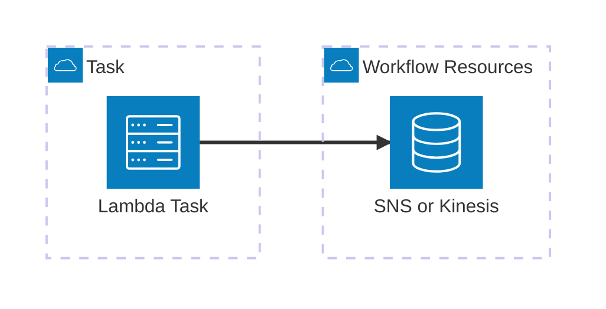

# @cumulus/cnm-response

This task responds to a provider using the CNM protocol over any number of SNS
topics or Kinesis streams. The task generates a CNM-R based on an input CNM-S
message and workflow exception.

When responding over SNS, messages are sent with message attributes which can
be used to set up subscription filters. The message attributes available are:

| attribute name | source
| -------------- | ------
| COLLECTION     | cnm.collection.name
| CNM_RESPONSE_STATUS | cnm.response.status
| DATA_VERSION   | cnm.product.dataVersion
| dataProcessingType | cnm.product.dataProcessingType
| trace          | cnm.trace

## Usage

This lambda takes the following input and config objects, derived from workflow configuration using the [Cumulus Message Adapter](https://github.com/nasa/cumulus-message-adapter/blob/master/CONTRACT.md) to drive configuration from the full cumulus message. The output from the task follows the Cumulus Message Adapter contract and provides the information detailed below.

### Configuration

| field name | type | default | required | description
| ---------- | ---- | ------- | -------- | -----------
| cnm        | object | N/A   | yes      | The input CNM-S to the workflow
| responseArns | array | N/A  | yes      | The ARN of the stream to write out to
| exception | string \| object | N/A | yes | The 'exception' field from the workflow
| distribution_endpoint | string | N/A | no | HTTP endpoint to use for file URIs. If not provided, s3 URIs will be used instead.

The following is an example of a valid configuration for the task:
```json
{
  "cnm": {
    "identifier": "c1f1be11-9cbd-4620-ad07-9a7f2afb8349",
    "product": {
      "name": "Merged_TOPEX_Jason_OSTM_Jason-3_Cycle_945.V4_2.nc",
      "dataVersion": "1.0"
      "files": [
        {
          "checksumType": "md5",
          "checksum": "00000000000000000000000000000000",
          "uri": "s3://podaac-sndbx-staging/c1f1be11-9cbd-4620-ad07-9a7f2afb8349/store/merged_alt/open/L2/TP_J1_OSTM/cycles/Merged_TOPEX_Jason_OSTM_Jason-3_Cycle_945.V4_2.nc",
          "name": "Merged_TOPEX_Jason_OSTM_Jason-3_Cycle_945.V4_2.nc",
          "type": "data",
          "size": 18795152
        },
        {
          "checksumType": "md5",
          "checksum": "00000000000000000000000000000000",
          "uri": "s3://podaac-sndbx-staging/c1f1be11-9cbd-4620-ad07-9a7f2afb8349/store/merged_alt/open/L2/TP_J1_OSTM/cycles/Merged_TOPEX_Jason_OSTM_Jason-3_Cycle_945.V4_2.nc.md5",
          "name": "Merged_TOPEX_Jason_OSTM_Jason-3_Cycle_945.V4_2.nc.md5",
          "type": "metadata",
          "size": 32
        }
      ],
    },
    "receivedTime": "2020-04-08T16:00:16.958Z",
    "collection": "MERGED_TP_J1_OSTM_OST_CYCLES_V42",
    "version": "1.1",
    "provider": "NASA/JPL/PO.DAAC",
    "submissionTime": "2020-04-08 15:59:15.186779"
  },
  "distribution_endpoint": "https://g928e05in1.execute-api.us-east-1.amazonaws.com/dev/",
  "exception": "None",
  "responseArns": ["arn:aws:sns:us-west-2:123456789012:test-cnm-response"]
}
```

### Input

Input object fields:

| field name | type | default | description
| ---------- | ---- | ------- | -----------
| granules   | array\<object\> | (required) | List of granule objects

The following is an example of a valid input for the task:
```json
{
  "granules": [
    {
      "granuleId": "Merged_TOPEX_Jason_OSTM_Jason-3_Cycle_945.V4_2",
      "dataType": "MERGED_TP_J1_OSTM_OST_CYCLES_V42",
      "version": "1",
      "files": [
        {
          "bucket": "test-protected",
          "checksum": "00000000000000000000000000000000",
          "checksumType": "md5",
          "fileName": "Merged_TOPEX_Jason_OSTM_Jason-3_Cycle_945.V4_2.nc",
          "key": "Merged_TOPEX_Jason_OSTM_Jason-3_Cycle_945.V4_2.nc",
          "size": 18795152,
          "type": "data"
        },
        {
          "bucket": "test-public",
          "checksum": "00000000000000000000000000000000",
          "checksumType": "md5",
          "fileName": "Merged_TOPEX_Jason_OSTM_Jason-3_Cycle_945.V4_2.cmr.json",
          "key": "Merged_TOPEX_Jason_OSTM_Jason-3_Cycle_945.V4_2.cmr.json",
          "size": 1236,
          "type": "metadata"
        }
      ],
      "cmrConceptId": "G1234313662-POCUMULUS",
      "cmrLink": "https://cmr.uat.earthdata.nasa.gov/search/granules.json?concept_id=G1234313662-POCUMULUS",
      "cmrMetadataFormat": "umm_json_v1_6",
      "post_to_cmr_duration": 11650,
      "published": true,
      "sync_granule_duration": 3136
    }
  ]
}
```

### Output

Output object fields:

| field name | type | default | description
| ---------- | ---- | ------- | -----------
| cnm        | object | N/A   | The output CNM-R generated in response to the input CNM-S.
| input      | object | N/A   | The original input payload

The following is an example of a valid output for the task:
```json
{
  "cnm": {
    "product": {
      "files": [
        {
          "checksumType": "md5",
          "checksum": "3b6de83e361a01867a9e541a4bf771dc",
          "uri": "s3://test-protected/Merged_TOPEX_Jason_OSTM_Jason-3_Cycle_945.V4_2.nc",
          "name": "Merged_TOPEX_Jason_OSTM_Jason-3_Cycle_945.V4_2.nc",
          "type": "data",
          "size": 18795152
        },
        {
          "checksumType": "md5",
          "checksum": "11236de83e361eesss332f771dc",
          "uri": "s3://test-public/Merged_TOPEX_Jason_OSTM_Jason-3_Cycle_945.V4_2.cmr.json",
          "name": "Merged_TOPEX_Jason_OSTM_Jason-3_Cycle_945.V4_2.cmr.json",
          "type": "metadata",
          "size": 1236
        }
      ],
      "name": "Merged_TOPEX_Jason_OSTM_Jason-3_Cycle_945.V4_2",
      "dataVersion": "1.0"
    },
    "receivedTime": "2020-04-08T16:00:16.958Z",
    "collection": "MERGED_TP_J1_OSTM_OST_CYCLES_V42",
    "version": "1.1",
    "provider": "NASA/JPL/PO.DAAC",
    "submissionTime": "2020-04-08 15:59:15.186779",
    "identifier": "c1f1be11-9cbd-4620-ad07-9a7f2afb8349",
    "response": {
      "status": "SUCCESS"
    },
    "processCompleteTime": "2026-01-01 20:50:35Z"
  },
  "input": {
    "granules": [
      {
        "granuleId": "Merged_TOPEX_Jason_OSTM_Jason-3_Cycle_945.V4_2",
        "dataType": "MERGED_TP_J1_OSTM_OST_CYCLES_V42",
        "version": "1",
        "files": [
          {
            "bucket": "test-protected",
            "checksum": "00000000000000000000000000000000",
            "checksumType": "md5",
            "fileName": "Merged_TOPEX_Jason_OSTM_Jason-3_Cycle_945.V4_2.nc",
            "key": "Merged_TOPEX_Jason_OSTM_Jason-3_Cycle_945.V4_2.nc",
            "size": 18795152,
            "type": "data"
          },
          {
            "bucket": "test-public",
            "checksum": "00000000000000000000000000000000",
            "checksumType": "md5",
            "fileName": "Merged_TOPEX_Jason_OSTM_Jason-3_Cycle_945.V4_2.cmr.json",
            "key": "Merged_TOPEX_Jason_OSTM_Jason-3_Cycle_945.V4_2.cmr.json",
            "size": 1236,
            "type": "metadata"
          }
        ],
        "cmrConceptId": "G1234313662-POCUMULUS",
        "cmrLink": "https://cmr.uat.earthdata.nasa.gov/search/granules.json?concept_id=G1234313662-POCUMULUS",
        "cmrMetadataFormat": "umm_json_v1_6",
        "post_to_cmr_duration": 11650,
        "published": true,
        "sync_granule_duration": 3136
      }
    ]
  }
}
```

### Example workflow configuration and use

This task should typically be the final task in a CNM ingest workflow, following
all other tasks necessary to complete ingest. It will need to be set up as two
separate states in the state machine, one for the success case and one for the
failure case with all other state 'Catch' sections routing to the
CnmResponseFailure state. An example of the full setup can be found in the
example [cnm_workflow.asl.json](../../example/cumulus-tf/cnm_workflow.asl.json).

```json
{
  "CnmResponse": {
    "Parameters": {
      "cma": {
        "event.$": "$",
        "task_config": {
          "cnm": "{$.meta.cnm}",
          "distribution_endpoint": "{$.meta.distribution_endpoint}",
          "exception": "{$.exception}",
          "responseArns": ["{$.meta.cnmResponseStream}"],
          "cumulus_message": {
            "outputs": [
              {
                "source": "{$.cnm}",
                "destination": "{$.meta.cnmResponse}"
              },
              {
                "source": "{$.input}",
                "destination": "{$.payload}"
              }
            ]
          }
        }
      }
    },
    "Type": "Task",
    "Resource": "${cnm_response_task_arn}",
    "Retry": [
      {
        "ErrorEquals": [
          "Lambda.ServiceException",
          "Lambda.AWSLambdaException",
          "Lambda.SdkClientException"
        ],
        "IntervalSeconds": 2,
        "MaxAttempts": 6,
        "BackoffRate": 2
      }
    ],
    "Catch": [
      {
        "ErrorEquals": ["States.ALL"],
        "ResultPath": "$.exception",
        "Next": "WorkflowFailed"
      }
    ],
    "Next": "WorkflowSucceeded"
  }
}
```

## Architecture

The task consists of a single lambda function that posts messages to an SNS
topic or Kinesis stream deployed separately.



### Internal Dependencies

The task will require one or more SNS topics or Kinesis streams for responses to
be sent to. These should be passed to the task config using the `responseArns`
list.

### External Dependencies

This task does not have any runtime external dependencies, however it is dependent on the following github packages when building:
 - https://github.com/nasa/cumulus-message-adapter
 - https://github.com/nasa/cumulus-message-adapter-python

## Contributing

To make a contribution, please [see our Cumulus contributing guidelines](https://github.com/nasa/cumulus/blob/master/CONTRIBUTING.md) and our documentation on [adding a task](https://nasa.github.io/cumulus/docs/adding-a-task)

## About Cumulus

Cumulus is a cloud-based data ingest, archive, distribution and management prototype for NASA's future Earth science data streams.

[Cumulus Documentation](https://nasa.github.io/cumulus)
