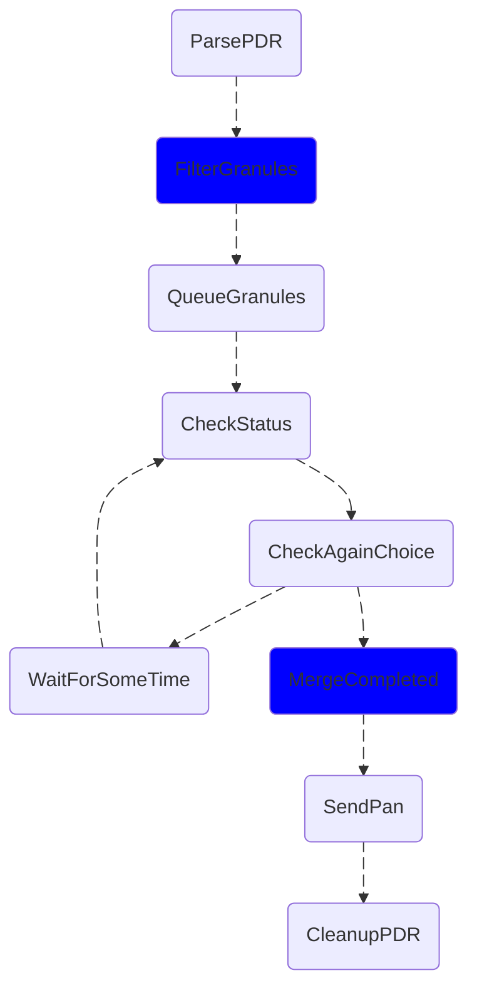

# @cumulus/filter-granules

This task is for filtering out completed granules and returning their completed workflow execution ARNs. It's used to aid retry functionality in the PDR workflow and ensure only failed granules are retried. A completed granule will be filterd out if it ingested successfully in a previous PDR, regardless of if it's in a new PDR

### Configuration

| field name | type | default | required | values | description
| ---------- | ---- | ------- | -------- | ------ | -----------
| granuleIngestWorkflow | string | N/A | yes | N/A | Granule Ingest workflow to search for when gathering completed ARNS
| filtering | boolean | True | no | N/A | A boolean that when set to false turns off the granule filtering

### Input

| field name | type | default | required | description
| ---------- | ---- | ------- | -------- | -----------
| granules | array[object] | N/A | yes | List of granules
| granules[].granuleId | string | N/A | yes| Granule ID
| granules[].producerGranuleId | string | N/A | no | Producer granule ID
| granules[].dataType | string | N/A | yes | Data type of the granule
| granules[].version | string | N/A | yes | Version of the granule
| granules[].granuleSize | integer | N/A | no | Size of the granule
| granules[].files | array[object] | N/A | no | List of files associated with granule
| granulesCount | integer | N/A | no | Total granules
| filesCount | integer | N/A | no | Total files
| totalSize | integer | N/A | no | Total size

### Output

| field name | type | description
| ---------- | ---- | -----------
| granules | array[object] | List of granules
| completed | array[string] | List of completed execution arns
| granulesCount | integer | Total granules
| filesCount | integer | Total files
| totalSize | integer | Total size

### Example workflow configuration and use

The `completed` output should be assigned to a workflow variable so that it can be concated later on in the workflow after the unfiltered granules have completed ingest. This task should be placed after the parsePDR task and before the granules are queued.

```json
"FilterGranules": {
    "Parameters": {
        "cma": {
            "event.$": "$",
            "task_config": {
                "granuleIngestWorkflow": "IngestUmmgGranuleNoCleanup"
            }
        }
    },
    "Type": "Task",
    "Resource": "<granuleFilterARN>",
    "Retry": [
        {
            "ErrorEquals": [
                "Lambda.ServiceException",
                "Lambda.AWSLambdaException",
                "Lambda.SdkClientException"
            ],
            "IntervalSeconds": 2,
            "MaxAttempts": 2,
            "BackoffRate": 2
        }
    ],
    "Catch": [
        {
            "ErrorEquals": [
                "States.ALL"
            ],
            "ResultPath": "$.exception",
            "Next": "WorkflowFailed"
        }
    ],
    "Assign": {
        "completed.$": "$.payload.completed"
    },
    "Next": "QueueGranules"
}
```

The results of this task should be merged with a pass state after the granules have completed ingest:

```json
"MergeCompleted": {
    "Type": "Pass",
    "QueryLanguage": "JSONata",
    "Output": "",
    "Next": "SendPAN"
}
```

## Architecture



### Internal Dependencies

This task uses the Cumulus Message Adapter and requires access to the Private API Lambda. The API lambda is used in conjection with the cumulus-api client. `PRIVATE_API_LAMBDA_ARN` should be set as an environment variable

### External Dependencies

https://github.com/ghrcdaac/cumulus-api

## Contributing

To make a contribution, please [see our Cumulus contributing guidelines](https://github.com/nasa/cumulus/blob/master/CONTRIBUTING.md) and our documentation on [adding a task](https://nasa.github.io/cumulus/docs/adding-a-task)

## About Cumulus

Cumulus is a cloud-based data ingest, archive, distribution and management prototype for NASA's future Earth science data streams.

[Cumulus Documentation](https://nasa.github.io/cumulus)
