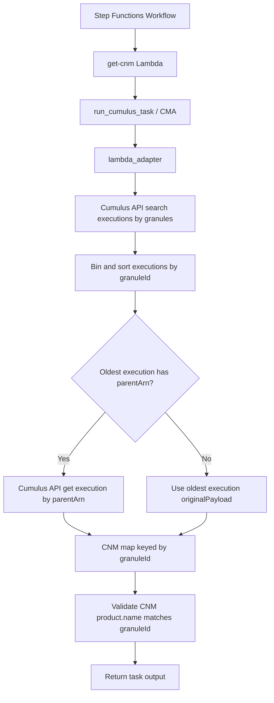

# @cumulus/get-cnm

This task retrieves the originating Cloud Notification Message (CNM) for each input granule.
It does this by querying Cumulus executions for the incoming granules, selecting the oldest
execution per granule, and returning that execution's `originalPayload` as the CNM message.

If the oldest execution has a `parentArn`, the task retrieves the parent execution and returns
the parent execution's `originalPayload` instead.

This task uses the Cumulus Message Adapter and is intended for use in a Cumulus workflow.

## Usage

This lambda takes the following input and config objects, derived from workflow
configuration using the
[Cumulus Message Adapter](https://github.com/nasa/cumulus-message-adapter/blob/master/CONTRACT.md)
to drive configuration from the full cumulus message. The output from the task follows the
Cumulus Message Adapter contract and provides the information detailed below.

### Configuration

This task does not require any task configuration.

| field name | type | default | required | values | description |
| ---------- | ---- | ------- | -------- | ------ | ----------- |
| N/A | N/A | N/A | no | N/A | No configurable fields are used by this task |

### Input

| field name | type | default | required | values | description |
| ---------- | ---- | ------- | -------- | ------ | ----------- |
| granules | array | N/A | yes | N/A | Array of granules to resolve back to originating CNM |
| granules[].granuleId | string | N/A | yes | N/A | Cumulus granule identifier |
| granules[].dataType | string | N/A | yes | N/A | Collection short name used to derive the Cumulus collection ID |
| granules[].version | string | N/A | yes | N/A | Collection version used to derive the Cumulus collection ID |
| granules[].files | array | N/A | yes | N/A | Granule files array required by task input schema (not used by CNM lookup logic) |

The following is an example of task input:

```json
{
	"granules": [
		{
			"granuleId": "ATL12_20181014154641_02450101_007_02.h5_-C-mRK2W",
			"dataType": "ATL12",
			"version": "007",
			"files": []
		},
		{
			"granuleId": "ATL12_20181014155468_02450101_007_02.h5_-C-mRK2W",
			"dataType": "ATL12",
			"version": "007",
			"files": []
		}
	]
}
```

### Output

The output is an object keyed by input `granuleId`. Each value is the originating
CNM message associated with that granule.

The task validates that `product.name` in each resolved CNM contains the input
`granuleId` value. If no execution is found for a granule, or the CNM `product.name`
does not match, the task raises an error.

The following is an example of task output:

```json
{
	"ATL12_20181014154641_02450101_007_02.h5_-C-mRK2W": {
		"product": {
			"name": "ATL12_20181014154641_02450101_007_02.h5"
		},
		"provider": "podaac",
		"version": "1.0"
	},
	"ATL12_20181014155468_02450101_007_02.h5_-C-mRK2W": {
		"product": {
			"name": "ATL12_20181014155468_02450101_007_02.h5"
		},
		"provider": "podaac",
		"version": "1.0"
	}
}
```

### Example workflow configuration and use

`get-cnm` is typically used as a `Task` state in a Cumulus Step Functions workflow and
invoked through the Cumulus Message Adapter contract.

Example ASL state definition:

```json
{
	"StartAt": "Get CNM",
	"States": {
		"Get CNM": {
			"Type": "Task",
			"Resource": "${get_cnm_arn}",
			"Parameters": {
				"cma": {
					"event.$": "$",
					"task_config": {}
				}
			},
			"Next": "Workflow Succeeded",
			"Catch": [
				{
					"ErrorEquals": ["States.ALL"],
					"Next": "Workflow Failed",
					"ResultPath": "$.error"
				}
			]
		},
		"Workflow Failed": {
			"Type": "Fail"
		},
		"Workflow Succeeded": {
			"Type": "Succeed"
		}
	}
}
```

Real repository examples:

- Workflow Terraform module wiring: `example/cumulus-tf/get_cnm_workflow.tf`
- Workflow ASL definition: `example/cumulus-tf/get_cnm_workflow.asl.json`
- Integration workflow exercise: `example/spec/parallel/getCnm/getCnmSpec.js`

## Architecture

At runtime, the task receives workflow input through the Cumulus Message Adapter,
queries Cumulus execution records for each incoming granule, selects the oldest matching
execution, optionally follows `parentArn` if it exists, and returns the originating CNM payload per
granule.



### Internal Dependencies

- Cumulus Message Adapter contract and wrapper (`run_cumulus_task`)
- Cumulus API execution endpoints via `cumulus_api.CumulusApi`:
	- `search_executions_by_granules`
	- `get_execution` (when `parentArn` is present)
- Cumulus execution metadata (`finalPayload`, `originalPayload`, `createdAt`) for
	granule-to-CNM resolution
- AWS Lambda runtime as the execution environment for the task

### External Dependencies

This task has no direct external enterprise-system calls (for example CMR/LZ/RDS
services) in its runtime logic. It derives CNM payloads from Cumulus-stored execution
records.

## Development and Deployment

Run task checks from `tasks/get-cnm`:

```bash
npm run lint
npm test
```

Package the task Lambda zip:

```bash
npm run package
```

Task-specific deployment as an individual Lambda is documented in:

- `tasks/get-cnm/deploy/README.md`

Key test coverage locations:

- Unit tests: `tasks/get-cnm/tests/unit_tests/get-cnm/test_get_cnm.py`
- Integration tests: `tasks/get-cnm/tests/integration_tests/get-cnm/test_lambda_handler.py`

## Contributing

To make a contribution, please [see our Cumulus contributing guidelines](https://github.com/nasa/cumulus/blob/master/CONTRIBUTING.md) and our documentation on [adding a task](https://nasa.github.io/cumulus/docs/adding-a-task)

## About Cumulus

Cumulus is a cloud-based data ingest, archive, distribution and management prototype for NASA's future Earth science data streams.

[Cumulus Documentation](https://nasa.github.io/cumulus)
