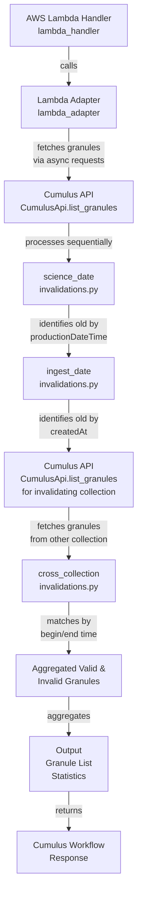

# @cumulus/granule-invalidator

This task queries the Cumulus API for granules that fulfill certain criteria as defined in `src/invalidations.py`.  Currently, the criteria that can be optionally specified via config (see Configuration section) are:

 - science_date - any granules that have a science date older than the specified time
 - ingest_date - any granules that have an ingest date older than the specified time
 - cross_collection - any granules that have corresponding granules in another collection that match with the same begin/end time

This task uses the Cumulus Message Adapter and is intended for use in a Cumulus workflow.  This task is meant to be run against a single collection and version.  Importantly, this repository does not alter the database, it only identifies a list of granules that fulfills the criteria.

## Usage

This lambda takes the following input and config objects, derived from workflow configuration using the [Cumulus Message Adapter](https://github.com/nasa/cumulus-message-adapter/blob/master/CONTRACT.md) to drive configuration from the full cumulus message. The output from the task follows the Cumulus Message Adapter contract and provides the information detailed below.

### Configuration

| field name | type | default | required | values | description
| ---------- | ---- | ------- | -------- | ------ | -----------
| collection | string | N/A | yes | N/A | The collection shortname to apply invalidations to
| version | string | N/A | yes | N/A | The version of the collection to apply invalidations to
| page_length_ms | integer | 604800000 | no | N/A | Time window in milliseconds for pagination; defaults to 7 days
| granule_invalidations | array | N/A | yes | N/A | Array of invalidation criteria objects
| granule_invalidations[].type | string | N/A | yes | `science_date`, `ingest_date`, `cross_collection` | The type of invalidation to apply
| granule_invalidations[].maximum_minutes_old | integer | N/A | conditional | N/A | Maximum age in minutes; required for `science_date` and `ingest_date` types
| granule_invalidations[].invalidating_collection | string | N/A | conditional | N/A | Collection shortname of granules to match against; required for `cross_collection` type
| granule_invalidations[].invalidating_version | string | N/A | conditional | N/A | Collection version of granules to match against; required for `cross_collection` type

The following sample configuration lists all AMSR_E_L2_Rain v13 granules older than 525600 minutes and all granules that have a corresponding granule in the AMSR_E_L2_Ocean v13 collection that match beginning and end time:

```json
{
  "collection": "AMSR_E_L2_Rain",
  "version": "13",
  "granule_invalidations": [
    {
      "type": "science_date",
      "maximum_minutes_old": 525600
    },
    {
      "type": "cross_collection",
      "invalidating_collection": "AMSR_E_L2_Ocean",
      "invalidating_version": "13"
    }
  ]
}
```

### Input

The input field for this task is expected to be empty.

### Output

In general, the output can be used to identify specifically which granules are to be removed, in the structure that a Cumulus bulk delete API call accepts and provide human-readable stats to verify validity of this set of granules.  It is often useful to store the `granules` field in a remote message, as this list can easily exceed the maximum length of a StepFunctions payload and allows for easy inspection by operators.  The following is an example of the output of this task:

```json
{
  "granules": [
    {
      "granuleId": "AMSR_E_L2_Rain_V13_200206020859_D",
      "collectionId": "AMSR_E_L2_Rain___13"
    },
    {
      "granuleId": "AMSR_E_L2_Rain_V13_200206021100_D",
      "collectionId": "AMSR_E_L2_Rain___13"
    },
    {
      "granuleId": "AMSR_E_L2_Rain_V13_200206021430_D",
      "collectionId": "AMSR_E_L2_Rain___13"
    }
  ],
  "forceRemoveFromCmr": true,
  "granules_to_be_deleted_count": 3,
  "aggregated_stats": "Total number of granules to be removed: 3\nTotal number of granules to be retained: 97\nGranules to be removed by invalidation type:\nscience_date - 2 granules\ncross_collection - 1 granules\n"
}
```


### Example workflow configuration

This lambda only fulfils part of the overarching goal - which is to identify, then remove granules from Cumulus.  To achieve the goal, you may set up a scheduled Cumulus rule.  This workflow might:

 * Run the granules-to-delete identification task to identify which granules should be removed
 * Using an SNS topic/endpoint, send an email with details about what should be deleted based on configuration passed into the task
 * Wait for a configurable amount of time for ops intervention if they identify something that should not be deleted in that list
 * Call the Cumulus Private API lambda from the workflow and use the Bulk Delete endpoint to delete these granules from Cumulus and CMR

A sample definition of this workflow could look like:

```json
{
    "StartAt": "Is Wait Time Set?",
    "States": {
      "Is Wait Time Set?": {
          "Type": "Choice",
          "Choices": [
              {
                "Not": {
                    "Variable": "$.meta.waitSeconds",
                    "IsPresent": true
                },
                "Next": "Set Default Wait Time"
              }
          ],
          "Default": "Identify Granules to Delete"
      },
      "Set Default Wait Time": {
          "Type": "Pass",
          "Result": "${default_wait_s}",
          "ResultPath": "$.meta.waitSeconds",
          "Next": "Identify Granules to Delete"
      },
      "Identify Granules to Delete": {
        "Type": "Task",
        "Resource": "${granule_invalidator_arn}",
        "Next": "Are there granules to delete?",
        "Parameters": {
          "cma": {
            "event.$": "$",
            "ReplaceConfig": {
              "Path": "$.payload.granules"
            },
            "task_config": {
              "granule_invalidations": "{$.meta.collection.meta.granule_invalidations}",
              "collection": "{$.meta.collection.name}",
              "version": "{$.meta.collection.version}",
              "cumulus_message": {
                "outputs": [
                  {
                    "source": "{$.aggregated_stats}",
                    "destination": "{$.meta.aggregated_stats}"
                  },
                  {
                    "source": "{$.granules_to_be_deleted_count}",
                    "destination": "{$.meta.granules_to_be_deleted_count}"
                  },
                  {
                    "source": "{$.granules}",
                    "destination": "{$.payload.granules}"
                  },
                  {
                    "source": "{$.forceRemoveFromCmr}",
                    "destination": "{$.payload.forceRemoveFromCmr}"
                  }
                ]
              }
            }
          }
        },
        "Catch": [
          {
            "ErrorEquals": ["States.ALL"],
            "Next": "Notify Ops of Failure",
            "ResultPath": "$.error"
          }
        ],
        "Assign": {
          "deletion_count.$": "$.meta.granules_to_be_deleted_count"
        }
      },
      "Are there granules to delete?": {
        "Type": "Choice",
        "Choices": [
          {
            "Variable": "$deletion_count",
            "NumericGreaterThan": 0,
            "Next": "Notify Ops of Deletion Information"
          }
        ],
        "Default": "Notify Ops of Nothing to Delete"
      },
      "Notify Ops of Deletion Information": {
        "Type": "Task",
        "Resource": "arn:aws:states:::sns:publish",
        "Parameters": {
          "Subject.$": "States.Format('QuickLook Deletion - Scheduled for {} granules for {}.{}', $deletion_count, $.meta.collection.name, $.meta.collection.version)",
          "Message.$": ${jsonencode(notification_template)},
          "TopicArn": "${ops_notification_arn}"
        },
        "ResultPath": null,
        "Next": "Wait for Ops Intervention"
      },
      "Notify Ops of Nothing to Delete": {
        "Type": "Task",
        "Resource": "arn:aws:states:::sns:publish",
        "Parameters": {
          "Subject.$": "States.Format('QuickLook Deletion - Nothing to delete for {}.{}', $.meta.collection.name, $.meta.collection.version)",
          "Message.$": ${jsonencode(noop_template)},
          "TopicArn": "${ops_notification_arn}"
        },
        "ResultPath": null,
        "End": true
      },
      "Wait for Ops Intervention": {
        "Type": "Wait",
        "SecondsPath": "$.meta.waitSeconds",
        "Next": "Reload Message"
      },
      "Reload Message": {
        "Type": "Task",
        "Resource": "${cumulus_message_manipulator_arn}",
        "Next": "Bulk Delete",
        "Parameters": {
          "cma": {
            "event.$": "$",
            "task_config": {
                "manipulation_action": "noop",
                "manipulation_params": {}
            }
          }
        },
        "Catch": [
          {
            "ErrorEquals": ["States.ALL"],
            "Next": "Notify Ops of Failure",
            "ResultPath": "$.error"
          }
        ]
      },
      "Bulk Delete": {
        "Type": "Task",
        "Resource": "${cumulus_internal_api_arn}",
        "Next": "Wait for Bulk Delete to Finish",
        "Parameters": {
          "httpMethod": "POST",
          "resource": "{proxy+}",
          "path": "/granules/bulkDelete",
          "headers": {
            "Content-Type": "application/json"
          },
          "body.$": "States.JsonToString($.payload)"
        },
        "Catch": [
          {
            "ErrorEquals": ["States.ALL"],
            "Next": "Notify Ops of Failure",
            "ResultPath": "$.error"
          }
        ],
        "ResultSelector": {
          "api_return.$": "States.StringToJson($.body)"
        },
        "ResultPath": "$.payload"
      },
      "Check Bulk Delete Status": {
        "Type": "Task",
        "Resource": "${cumulus_internal_api_arn}",
        "Parameters": {
          "httpMethod": "GET",
          "resource": "{proxy+}",
          "path.$": "States.Format('/asyncOperations/{}', $.payload.api_return.id)",
          "headers": {
            "Content-Type": "application/json"
          }
        },
        "ResultSelector": {
          "api_return.$": "States.StringToJson($.body)"
        },
        "ResultPath": "$.payload",
        "Next": "Is bulk delete done?"
      },
      "Is bulk delete done?": {
        "Type": "Choice",
        "Choices": [
          {
            "Variable": "$.payload.api_return.status",
            "StringMatches": "RUNNING",
            "Next": "Wait for Bulk Delete to Finish"
          },
          {
            "Variable": "$.payload.api_return.status",
            "StringMatches": "SUCCEEDED",
            "Next": "Notify Ops of Successful Deletion"
          }
        ],
        "Default": "Notify Ops of Failure"
      },
      "Wait for Bulk Delete to Finish": {
        "Type": "Wait",
        "Seconds": 60,
        "Next": "Check Bulk Delete Status"
      },
      "Notify Ops of Successful Deletion": {
        "Type": "Task",
        "Resource": "arn:aws:states:::sns:publish",
        "Parameters": {
          "Subject.$": "States.Format('QuickLook Deletion - Successfully deleted {} granules for {}.{}', $deletion_count, $.meta.collection.name, $.meta.collection.version)",
          "Message.$": ${jsonencode(success_template)},
          "TopicArn": "${ops_notification_arn}"
        },
        "ResultPath": null,
        "End": true
      },
      "Notify Ops of Failure": {
        "Type": "Task",
        "Resource": "arn:aws:states:::sns:publish",
        "Parameters": {
          "Subject.$": "States.Format('QuickLook Deletion - Delete Failed for {}.{}', $.meta.collection.name, $.meta.collection.version)",
          "Message.$": ${jsonencode(failure_template)},
          "TopicArn": "${ops_notification_arn}"
        },
        "Next": "Workflow Failed",
        "ResultPath": null
      },
      "Workflow Failed": {
        "Type": "Fail"
      }
    }
  }
```

## Architecture


### Internal Dependencies

This task relies on access to the Cumulus API via the Private API lambda.  This API interaction is run through the cumulus-api python client which requires the `PRIVATE_API_LAMBDA_ARN` environment variable to be set.  Additionally, the task must have permissions to invoke the Private API lambda.

### External Dependencies

This task does not have any runtime external dependencies, however it is dependent on the following github packages when building:
 - https://github.com/ghrcdaac/cumulus-api
 - https://github.com/nasa/cumulus-message-adapter
 - https://github.com/nasa/cumulus-message-adapter-python

The typical workflow configuration for this task does contain an indirect dependency on the Common Metadata Repository (CMR) - when running the bulk delete, the granules are also removed from CMR.

## Contributing

To make a contribution, please [see our Cumulus contributing guidelines](https://github.com/nasa/cumulus/blob/master/CONTRIBUTING.md) and our documentation on [adding a task](https://nasa.github.io/cumulus/docs/adding-a-task)

## About Cumulus

Cumulus is a cloud-based data ingest, archive, distribution and management prototype for NASA's future Earth science data streams.

[Cumulus Documentation](https://nasa.github.io/cumulus)