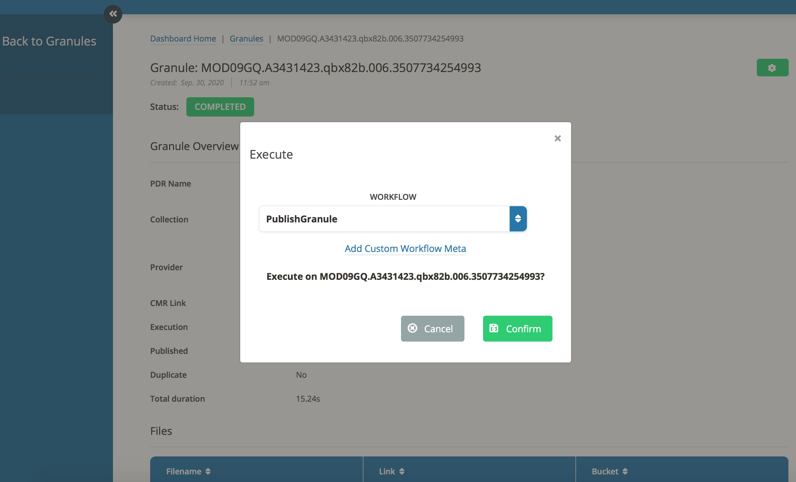
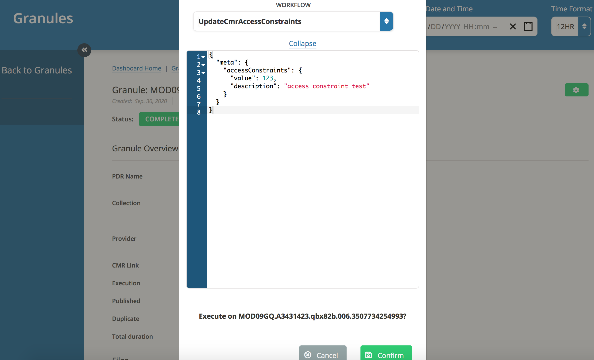

This document will outline basic procedures to interact with CMR on a per-granule basis, both via the Cumulus Dashboard, and Cumulus API requests.
We rely on the Cumulus API's `ApplyWorkflow` functionality to accomplish these actions.

## Publishing a granule to CMR

Publishing a granule requires your Cumulus deployment have a workflow that contains only the `PostToCmr` task provided by Cumulus Core. The rest of this section will assume you have created this workflow under the name `PublishGranule`.

Using either method below, Cumulus will take an unpublished granule and publish it to CMR:

To do this via the dashboard, use the dashboard's `Execute` button to open the workflow popup shown below and select the `PublishGranule` workflow:



An example invocation of the API to perform this action is:

```bash
$ curl --request PUT https://example.com/granules/MOD11A1.A2017137.h19v16.006.2017138085750 \
--header 'Authorization: Bearer ReplaceWithTheToken' \
--header 'Content-Type: application/json' \
--data '{ "action": "applyWorkflow", "workflow": "PublishGranule" }'
```

## Setting granule access constraints in CMR Metadata

Updating metadata access constraints can be accomplished using the applyWorkflow functionality.
For this, we use a workflow composed of the `UpdateCmrAccessConstraints` and `PostToCmr` tasks.
`UpdateCmrAccessConstraints` will update CMR metadata file contents on S3, and `PostToCmr` will push the updates to CMR.
The rest of this section will assume you have created this workflow under the name `UpdateCmrAccessConstraints`.

Once created and deployed, the workflow is available in the Cumulus dashboard's `Execute` workflow selector.
However, note that additional configuration is required for this request, to supply an access constraint integer value and optional description to the `UpdateCmrAccessConstraints` workflow, by clicking the `Add Custom Workflow Meta` option in the `Execute` popup, as shown below:



An example invocation of the API to perform this action is:

```bash
$ curl --request PUT https://example.com/granules/MOD11A1.A2017137.h19v16.006.2017138085750 \
--header 'Authorization: Bearer ReplaceWithTheToken' \
--header 'Content-Type: application/json' \
--data '{
  "action": "applyWorkflow",
  "workflow": "updateCmrAccessConstraints",
  "meta": {
    accessConstraints: {
      value: 5,
      description: "sample access constraint"
    }
  }
}'
```

Supported CMR metadata formats for the above operation are Echo10XML and UMMG-JSON, which will populate the `RestrictionFlag` and `RestrictionComment` fields in Echo10XML, or the `AccessConstraints` values in UMMG-JSON.

## Additional Operations

At this time Cumulus does not, out of the box, support additional operations on CMR metadata. However, given the examples shown above, we recommend working with your integrators to develop additional workflows that perform any required operations.

## Bulk CMR operations

In order to perform the above operations in bulk, Cumulus supports the use of `ApplyWorkflow` in an `AsyncOperation`. These are accessed via the `Bulk Operation` button on the dashboard, or the `/granules/bulk` endpoint on the Cumulus API.

More information on bulk operations are in the [bulk operations operator doc](../operator-docs/bulk-operations).
