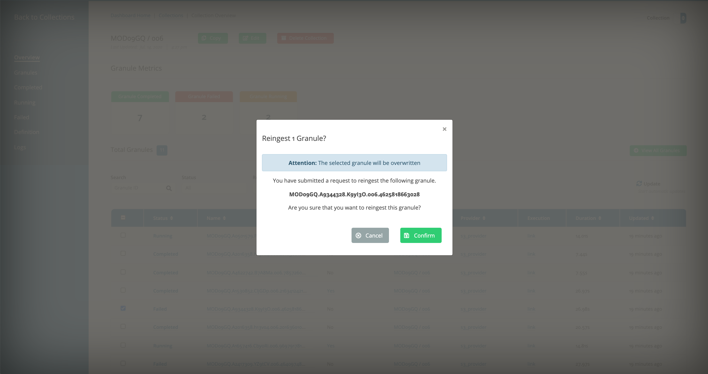
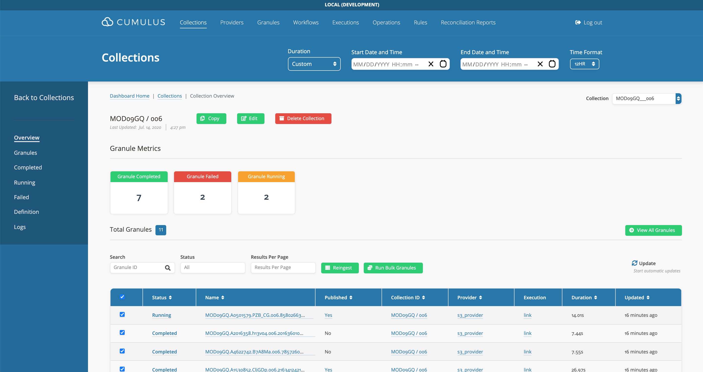
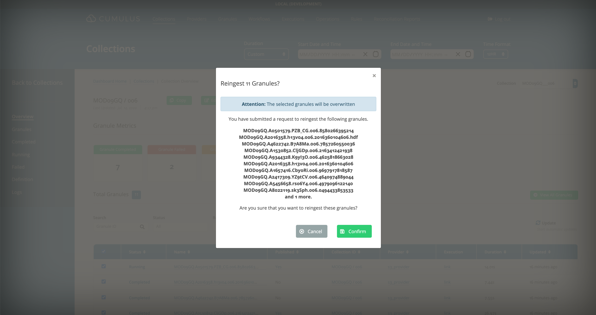

## Failed Granule

<!-- markdownlint-disable MD029 -->

### Delete and Ingest

1. Delete Granule

:::note

Granules published to CMR will need to be removed from CMR via the dashboard prior to deletion.

:::

2. Ingest Granule via Ingest Rule

* Re-trigger a one-time, kinesis, SQS, or SNS rule or a scheduled rule will re-discover and reingest the deleted granule.

### Reingest

1. Select Failed Granule

* In the Cumulus dashboard, go to the `Collections` page.
* Use search field to find the granule.

2. Re-ingest Granule

* Go to the `Collections` page.
* Click on `Reingest` and a modal will pop up for your confirmation.

### Delete and Ingest

1. Bulk Delete Granules

* Go to the `Granules` page.
* Use the `Bulk Delete` button to bulk delete selected granules or select via a Kibana query

:::tip

You can optionally force deletion from CMR.

:::

2. Ingest Granules via Ingest Rule

* Re-trigger one-time, kinesis, SQS, or SNS rules or scheduled rules will re-discover and reingest the deleted granule.

## Multiple Failed Granules

1. Select Failed Granules

* In the Cumulus dashboard, go to the `Collections` page.
* Click on `Failed Granules`.
* Select multiple granules.

2. Bulk Re-ingest Granules

* Click on `Reingest` and a modal will pop up for your confirmation.

<!-- markdownlint-enable MD029 -->
